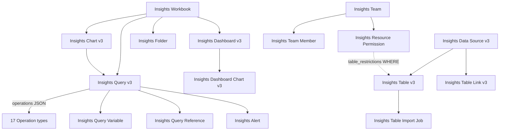

# Nakhoda — an AI-native analytics platform for Frappe/ERPNext

Deep research report on `frappe/insights`, and the build proposal it produced · 2026-08-11
· **rev. 6 — the agent layer is now grounded in a working Frappe agent.** Raven 2.8.12
was read in full on this bench (`openai-agents 0.18.3`): §6.2 is rewritten from a sketch
into a measured design, keeping Raven's tool layer and rejecting its manager and
transcript. Three corrections land: Insights' permission layer is **stronger** than rev. 5
implied and moves from "rebuild lean" to the most expensive non-AI component (§3.2, §6.9);
plugins must use **client-side** MCP, because the hosted tool Raven uses is stripped on-prem;
and §3.2 now cites the exact line where the #919 class becomes invisible. Full dossier:
`13-agent-design.md`.
· **rev. 5 — the product has a name and a boundary: Nakhoda, standalone.** §6 is
rewritten from "extend Insights" to "replace it": Nakhoda is an independent Frappe app
that takes no dependency on `insights`. Adds §6.9 (what to reuse, rebuild and refuse,
with the rebuild surface measured), rewrites risk 4 — which was *"you are not the
maintainer"* and is now a rebuild-cost and vendor-race risk — and renames the proposed
DocTypes. Naming decision and collision evidence: `11-naming.md`. Execution plan:
`12-build-plan.md`.
· **rev. 4 — the central thesis is now measured, not cited.** Adds §6.0 (a paired
NL2SQL experiment on a real ERPNext-derived schema: **78.3% → 95.8%, +17.5 pp**,
p = 1.9e-05) and §5.7 (the three live ERPNext NL2SQL competitors, and why changAI's
architecture confirms the thesis by inverting it). Rewrites §0 finding 2 around the
measurement, adds finding 5, relocates risk 5 from "unmeasured" to "measured, and the
residual is measures + scale", and corrects a scout-reported annotation-error figure.
· rev. 3 — adds §5.6 (Genie Ontology), §6.6 (measured substrate), §6.7 (AI/BI page),
§6.8 (three Databricks ebooks); **corrects the §0 auto-derivation moat claim**, which
rev. 2 stated too broadly, and reorders §7

Subject: `/Users/mac/ERPNext/nvumabaranda/apps/insights` @ `ea62bf6` (branch `develop`)
Question as asked: can Insights become a pure-Frappe data science platform with NL2SQL,
an AI coworker, artifacts, and an AI plugin/skill system — a credible Databricks rival?
Answer, and the subject of §6 onward: **Nakhoda** — a standalone Frappe app that rivals
Insights rather than extending it, built AI-native from the semantic layer up.

Supporting dossiers in this directory: `05-community.md`, `06-competitive.md`,
`09-prior-art.md`, `10-eval-methodology.md`, `11-naming.md`, `12-build-plan.md`,
`13-agent-design.md` (Raven + VS Code agent design, behind §6.2), `13d-vscode-manager.md`,
`13e-vscode-tools.md`, `14-frontend-design.md` (+ runnable mockup in `mockup/`),
`15-ml-dashboards.md` (the jkm Insights fork's ML + chat dashboards, behind §4.2), the
`07*` competitor dossiers, the `semantic-bench/` artifacts behind §6.0, and the
`dfbench/` artifacts behind §6.6.
Citations `path:line` are relative to the Insights app root unless prefixed; Raven cites
are relative to `/Users/mac/ERPNext/kimcov16/apps/raven/raven`, and `jkm/…` cites to
`/Users/mac/ERPNext/jkm/apps/insights`.

---

## 0. Verdict

**Yes — but the product you should build is not the one implied by the question.**

Five findings drive everything else. **Finding 2 is now measured on this workstation,
not cited — see §6.0.**

1. **The compute substrate is already peer-grade.** Ibis 11 + DuckDB 1.4 + sqlglot is
   the *same* stack Rill, Evidence, WrenAI and Briefer are built on. You are not behind
   on the engine. `pyproject.toml:10-24`.

2. **NL2SQL accuracy is a semantic-layer problem, not a model problem — measured.** I
   built an authentic ERPNext-shaped database and ran a paired A/B: identical questions,
   identical models, raw DDL versus a semantic layer mechanically derived from DocType
   JSON. Accuracy went **78.3% → 95.8%, +17.5 pp** (McNemar exact, p = 1.9e-05, n = 120
   paired trials). The spread between the cheapest and best model collapsed from
   **42.5 pp to 7.5 pp**: the small model *with* the layer (95.0%) beat the frontier
   model *without* it (87.5%). Full protocol, artifacts and failure analysis in §6.0.
   This independently reproduces [arXiv:2604.25149](https://arxiv.org/abs/2604.25149)
   (+17 to +23 pp from a *hand-authored* 4 KB semantics doc) — except Frappe's layer
   costs nobody an afternoon. Corroborating ceilings: SOTA agents score **10.8%** on
   real enterprise warehouses (BEAVER,
   [arXiv:2409.02038](https://arxiv.org/abs/2409.02038)); a curated semantic layer
   reaches **94.15%** on Spider2-snow
   ([arXiv:2606.31041](https://arxiv.org/abs/2606.31041)). **Insights has no semantic
   layer.** That is the whole ballgame.

3. **Frappe hands you the semantic layer for free — declared, not inferred.** A DocType
   *is* a semantic model: labelled fields, typed columns, Link fields as an explicit
   join graph, Select options as an enumerated value domain, child tables as declared
   grain. `frappe.get_meta()` already returns all of it.
   **This claim was contested on 2026-06-16 — see §5.6.** Databricks shipped Genie
   Ontology, a knowledge graph that *infers* the same model from tables, queries,
   dashboards, pipelines and 50+ SaaS connectors, arbitrated by a PageRank-style
   "OntoRank". Auto-derivation is no longer unique. What survives is the *mechanism*:
   Databricks infers probabilistically from artifacts and needs OntoRank precisely
   because fifty sources disagree; Frappe reads one declaration that cannot disagree
   with itself. Inference carries an error rate and a cold start. Reading a field
   definition carries neither.

4. **Four independent competitors confirm the thesis — and one has already executed
   it.** Metabase built what its own engineering blog calls "a context engineering
   system"; Superset filed SIP-182 admitting its thin dataset abstraction is what
   blocks AI; Lightdash bet the company on dbt YAML; WrenAI built MDL and then pivoted
   away from chat-first in May 2026. Nobody who actually shipped this concluded the
   model was the bottleneck. But **Metabase 60 (Apr 2026) already ships, in AGPL, most
   of §6's roadmap**: Data Studio metrics, Python transforms, Documents, Metabot with
   BYOM, an MCP server, an Agent API, and models version-controlled as YAML in Git.
   See §5.5.

5. **The ERPNext NL2SQL niche is already occupied — thinly — and upstream Frappe is
   not in it.** Three live third-party projects already ship natural-language querying
   for Frappe (changAI, Frappe Assistant Core, NextAI; §5.7). None reads DocType
   metadata as a *declared* semantic layer — changAI, the most complete of them,
   treats schema understanding as an inference problem: a hand-curated bundle for
   stock ERPNext, plus an Anthropic API key so Claude can analyse your custom
   DocTypes. That is the 78.3% path §6.0 measures against. Frappe itself has **zero**
   AI code in framework v16 or Insights v3 — verified by grep — but that is narrower
   than "Frappe is not doing AI": `frappe/mcp` is a first-party repo (154★) that makes
   Frappe apps serve as MCP servers, Otto is reported in production on Frappe Cloud's
   ticket system, and Frappe Assistant Core is listed on the Frappe Cloud Marketplace
   (`05-community.md` §10.4). **None of it is analytics** — the MCP work exposes DocType
   CRUD and Otto is support triage — which is what keeps the gap real. There is no
   upstream collision *in analytics*, but the *idea* of app metadata as grounding is
   well-trodden elsewhere (Salesforce, Odoo, SQL Server 2025, and an arXiv paper
   published eleven days before this research; §5.7), so speed matters more than
   secrecy.

**Do not build a chat box over a schema.** Build the semantic layer, auto-derived from
DocType metadata, and the chat box becomes a two-week feature on top of it. That
product is **Nakhoda**: a standalone Frappe app, not a fork of Insights and not a
plugin to it (§6.9). Insights is the thing it has to beat, and §§1–3 of this report are
the teardown of the incumbent it beats. Name and collision checks: `11-naming.md`.

Rivalling Databricks head-on is not the play — distributed compute, Unity Catalog and
column-level lineage are genuinely hard and irrelevant to the addressable market. The
competitor that actually matters is **Metabase**, not Databricks (§8).

The defensible position, restated precisely after §5.6: not "we auto-derive and they
don't" — Databricks now does too — but **"our semantics were never lost."** Every
warehouse-based competitor is reconstructing meaning that ETL destroyed. Frappe never
destroyed it. That is why their version needs a knowledge graph, an authority-ranking
algorithm and a usage corpus, and why the Frappe version needs a loop over
`frappe.get_meta()`.

---

## 1. What Insights actually is

### 1.1 The dataframe question

The word "dataframe" is misleading here. There are two distinct layers and conflating
them causes bad design decisions.

**Layer 1 — ibis expressions (lazy, the real engine).** The unit of computation is an
`ibis.expr.types.Table`: a deferred expression tree, never materialised. A Query is an
ordered JSON list of Operations compiled step by step:

```python
# ibis_utils.py:102-116
for idx, operation in enumerate(self.operations):
    self.query = self.perform_operation(operation)
```

Nothing executes until `ibis.to_sql(query)` at `ibis_utils.py:929` and `query.execute()`
at `:948`. The pipeline is pushed down to the source database as one SQL statement.

**Layer 2 — pandas (materialisation only).** `query.execute()` returns a
`pd.DataFrame`, which is used strictly as a transport and serialisation format:
NaN/NaT normalisation (`:977`), caching as JSON records (`:1026-1030`), CSV/Excel
download. **No analysis happens in pandas.** Calling this a "pandas app" is wrong;
pandas is the last 5% of the path.

Complete operation → ibis mapping, from the dispatch table at `ibis_utils.py:120-155`:

| Operation | ibis call | Source |
|---|---|---|
| `source` | `InsightsTablev3.get_ibis_table()` / nested query `.build()` | `:223-224` |
| `join` | `.join(right, cond, how=)` (`full`→`outer`) | `:226-235` |
| `union` | `.union(other, distinct=)` + type coercion on common cols | `:338-360` |
| `filter` | `.filter(cond)` | `:362-364` |
| `filter_group` | `.filter(ibis.and_/or_(*conds))` | `:438-451` |
| `select` | `.select(names)` | `:453-456` |
| `rename` | `.rename(**{new: old})` | `:458-461` |
| `remove` | `.drop(*cols)` | `:463-475` |
| `cast` | `.cast({col: dtype})` | `:477-480` |
| `mutate` | `.mutate(**{name: expr})` | `:496-502` |
| `summarize` | `.aggregate(**aggs, by=dims)` | `:504-508` |
| `order_by` | `.order_by(ibis.asc/desc(col))` | `:510-515` |
| `limit` | `.limit(clamp(n, 1, 1_000_000))` | `:517-519` |
| `pivot_wider` | `group_by().aggregate()` → `.pivot_wider(...)` | `:521-573` |
| `custom_operation` | raw evaluated ibis expression | `:575-576` |
| `sql` | `db.sql(raw)` / `db.raw_sql()` for stored procs | `:578-639` |
| `code` | Python in RestrictedPython → DataFrame → temp DuckDB table | `:749-778` |

Note: `WindowOperation` is declared in `frontend/src2/types/query.types.ts` but is
**absent from the `Operation` union and unhandled in `perform_operation`** — vestigial.
Do not emit it.

### 1.2 Expression language

Every expression (`mutate`, filters, measures, joins, `custom_operation`) is Python
source, parsed with `ast`, executed via `exec_with_return` (`ibis_utils.py:1048-1078`),
which splits off the final expression and runs it through Frappe's
`safe_exec`/`safe_eval` (RestrictedPython). The namespace is assembled at `:883-897`:
current columns, plus **90 curated functions** (`ibis/functions.py`), plus 46
whitelisted `ibis.*` attributes and all ibis selectors (`ibis/utils.py:37-99`).

The function surface is stronger than expected: window analytics
(`previous_value`, `next_value`, `percentage_change`, `row_number`, `is_first_row`),
cohort/retention (`get_retention_data:1352`), bucketing (`create_buckets:1231`),
fiscal calendars, JSON extraction. There is also live syntax/type validation with Jedi
autocomplete (`ibis/utils.py:121-182`, `:415-433`).

**What is absent from the 90:** `stddev`, `variance`, `corr`, `covar`, arbitrary
`percentile`/`quantile` (only `median`), regression, `mode`, `skew`. No resampling,
no forecasting, no clustering, no classification. Aggregations exposed to the UI are
capped at six: `sum, count, avg, min, max, count_distinct` (`:811-825`).

### 1.3 Execution, limits, storage

- Single SQL statement per query; pagination injected as `.limit(page_size, offset)`,
  `page_size` clamped to 10,000 (`:922-926`).
- Result cache keyed on `digest(sql, backend_id)` in Redis, 1h default (`:935-940`).
- Live-source queries run under `@concurrent_limit(wait_timeout=0)` — **reject
  immediately with 503 rather than queue**, because a blocked query holds a web worker
  (`:984-991`). Frontend retries with jittered backoff, max 6 in flight.
- Defaults from `Insights Settings`: `max_execution_time` 60s, `query_result_limit`
  1000, `apply_user_permissions` **on**, `enable_permissions` **off**,
  `allow_subquery` off, `enable_data_store` on. `max_memory_usage` has no DocType
  default — DuckDB's `memory_limit` falls back to 512 MB in code
  (`data_warehouse.py:487-488`).
- Data Store: **one DuckDB file per site**, `.../insights_data_warehouse/*.duckdb`,
  opened `read_only=True` for queries and a separate write connection for imports
  (`data_warehouse.py:56-97`). Imports are batched with a MERGE-based upsert
  (`:264-294`), batch size derived from `memory_limit / row_size` (`:651`). Weekly
  pruning of tables unused for 30 days, plus compaction (`:773-1008`).

Backends wired: MariaDB, PostgreSQL, SQLite, DuckDB, BigQuery, ClickHouse
(+ `frappe_db` and `rest_api` connectors; an `mssql.py` connector exists but is not in
the `database_type` options and is commented out of `pyproject.toml`).

---

## 2. Data science ceiling — and a security finding

### 2.1 There is already a Python execution path

Insights ships a `code` operation. User Python runs through `get_code_results`
(`ibis_utils.py:1111-1165`) and the resulting DataFrame is registered as a temp DuckDB
table so the rest of the pipeline can join against it. Production installs are
explicitly instructed to enable it (`README.md:105-109`,
`bench set-config -g server_script_enabled 1`).

But the surface handed to that code is a three-entry shim, not pandas:

```python
# ibis_utils.py:1112-1115
pandas = frappe._dict()
pandas.DataFrame = SafePandasDataFrame     # to_csv / to_json raise NotImplementedError
pandas.read_csv = pd.read_csv
pandas.json_normalize = pd.json_normalize
```

No numpy, no scipy, no sklearn, no statsmodels.

### 2.2 The restriction is a product choice, not a platform limit

I tested the sandbox directly in the bench venv:

- `import pandas` / `import numpy` / `import os` → **blocked**,
  `ImportError: __import__ not found`. RestrictedPython permits the `import` *syntax*
  (`check_import_names`) but the builtin is absent.
- **Any module object injected via `_globals` is fully usable.** Real `pandas` and
  `numpy` attributes resolve cleanly through Frappe's `_getattr_for_safe_exec`
  (`frappe/utils/safe_exec.py:542-553`); only dunder names and module-typed return
  values are refused. Verified working: `np.std`, `pd.Series.quantile`, `df.corr`.

So unlocking real statistics is a change to one dict. That is the good news.

### 2.3 The bad news: the existing shim is bypassable (verified)

`pandas.read_csv` is exposed unrestricted at `ibis_utils.py:1114`, and it returns a
**plain `pd.DataFrame`**, not the guarded `SafePandasDataFrame`. The `to_csv`/`to_json`
guard at `:1103-1108` is therefore trivially circumvented. Reproduced in a faithful
emulation of the sandbox globals:

| Attempt | Result |
|---|---|
| `pandas.DataFrame({...}).to_csv(path)` | BLOCKED (guard works) |
| `pandas.read_csv('/etc/hosts', ...)` | **RAN** — arbitrary local file read |
| `pandas.read_csv(...).to_csv('/tmp/_pwn.csv')` | **RAN** — arbitrary local file write, file created |
| `pandas.read_csv(<url>)` | reachable — outbound HTTP to any host |
| `df.query('a>1')` | **RAN** — reaches `pandas.eval`, outside RestrictedPython |

Impact: any user who can author a query in a workbook gets file read/write and
outbound HTTP as the bench user, on a deployment configured exactly as the README
instructs. The SSRF path notably bypasses the address policy that ADR-0002
(dated today, 2026-08-11) was written to enforce for webhooks — same threat, different
door.

Severity is bounded by requiring `server_script_enabled` and an authenticated
Insights user, so this is privilege escalation rather than pre-auth RCE. It should
still be fixed before any AI feature writes code into that operation — an LLM authoring
`code` operations turns a user-privilege issue into a prompt-injection-reachable one.

Minimum fix: wrap `read_csv` to reject non-allowlisted paths and URLs, return
`SafePandasDataFrame`, and drop `query`/`eval` from the exposed DataFrame surface.

### 2.4 What is genuinely missing for data science

Verified against source, not assumed:

- No statistical functions beyond `median` (§1.2).
- No Python/vectorised UDFs registered into DuckDB — ibis supports scalar and PyArrow
  UDFs on DuckDB; Insights exposes none.
- No notebook. A `code` operation is a single opaque cell in a pipeline, with no
  variables surviving between steps, no plots, no markdown, no intermediate display.
- No ML anything — no training, no model registry, no scoring, no feature store.
- No time-series resampling, forecasting, or anomaly detection.
- No artifacts: no persisted, versioned, shareable analysis object beyond a Workbook.
- Single-file DuckDB with `read_only` query connections caps concurrency and dataset
  size; the maintainer is already probing this (issue #1256, "Spike: parquet data store
  via DuckLake", 2026-07-25).

---

## 3. Design assessment

### 3.1 Data model

22 DocTypes. Workbook is a container; **queries, charts and dashboards are separate
DocTypes with FKs, not JSON blobs** — good, because it means an agent can create and
diff them individually with normal Frappe permissions.



**91 whitelisted endpoints** (enumerated by AST parse across the app). The frontend
funnels almost everything through `insights.api.run_doc_method`. This is already a
usable agent tool surface — `Query v3.execute`, `get_count`,
`get_distinct_column_values`, `get_columns_for_selection`, `get_schema`,
`get_data_source_tables`, `get_table_links` map one-to-one onto the tools an NL2SQL
agent needs.

### 3.2 Permissions — the ERPNext advantage, with a live crack

Three layers: role-based (`Insights User` / `Insights Admin`), team-scoped resource
permissions with a raw SQL `table_restrictions` WHERE clause injected at execution, and
DocShare for workbooks/charts/dashboards. Plus a Visibility ladder and a Data Authority
axis (`Viewer` vs `Author`) described in `CONTEXT.md:83-93`.

For an AI coworker this is the single best structural property: **an agent running as
`frappe.session.user` inherits row-level scoping automatically**. It cannot exfiltrate
rows the user cannot see, because the restriction is applied inside query compilation,
not in the prompt. Databricks and Snowflake bolt this on; Frappe has it natively.

**But:** issue [#919](https://github.com/frappe/insights/issues/919) — "User Permissions
not applied for dashboard chart data" — is open since 2026-03-11 and reconfirmed
2026-07-20. I read the thread directly. `get_permission_query_for_table("tabIssue Type")`
returns a bare `select * from \`tabIssue Type\``; restricted users see all rows. Also note
`enable_permissions` defaults to **0**.

The machinery around it is sound — `apply_row_permissions` compiles the permission query
into an ibis `semi_join`, correctly handling the case where the data sits in DuckDB but
the permission query must run against the site DB
(`insights_table_v3.py:356-367`), and it fails closed when no query comes back (`:327-328`).
The #919 class becomes invisible at one line: `if not _has_where_clause(permission_query):
return t` (`:330-331`) — right when a doctype is genuinely unrestricted, wrong when User
Permissions should have produced a restriction and silently did not.

If you are going to sell "the AI analyst that respects your ERP permissions", #919 is a
release blocker, not a bug. It is also the cheapest credibility win available.

### 3.3 Two things documented but not built

Worth flagging because both scouts and the repo's own docs assert them as real:

- **`ui_islands`** is defined in `CONTEXT.md:74-79` as the app's UI extension
  mechanism. A repo-wide grep across `.py`, `.ts`, `.vue`, `.json` finds **zero
  occurrences**. It does not exist. The only shipped extension hook is
  `insights_workbooks` (`hooks.py:36`).
- **ADR-0001's type-independent chart config** (`config = {dimensions, measures,
  display:{...}}`) is Accepted and dated 2026-08-05, but `chart.types.ts` still carries
  per-type slot names (`x_axis`, `label_column`, `location_column`, …) and no `display`
  key exists anywhere in `frontend/src2/charts/`. It is a decision, not an
  implementation.

Practical consequence: an AI that generates charts must target the **current**
per-type shape and will need migrating when ADR-0001 lands. Generate against the ADR
shape and normalise, or you will write the migration twice.

### 3.4 Frontend

Vue 3 + Vite, composables (not Pinia) with a `useDocumentResource` wrapper, echarts for
10 chart types, `grid-layout-plus` for dashboards, TipTap available for rich text.
Client-side execution queue: 6 concurrent, priority-ordered, exponential backoff on 503
(`frontend/src2/query/execution_queue.ts`).

Realtime exists (`frappe.realtime` over socket.io) but is used **only for toast
notifications**. Token streaming would reuse the transport, not build it.

Missing for an AI coworker UX: chat surface, markdown renderer, streaming display,
operation-diff preview, undo stack, artifact canvas. All are ordinary component work;
none are architectural blockers. The natural mount is a third flex child in
`workbook/Workbook.vue` beside `WorkbookSidebar`.

---

## 4. The AI gap, and the two implementations next door

### 4.1 Raven — the agent pattern

A repo-wide grep for `openai|anthropic|llm|gpt|claude|litellm|langchain|embedding|
nl2sql|text-to-sql|copilot|prompt` across the Insights backend returns **nothing**.
Zero AI code. No roadmap statement commits to any.

But you do not start from zero, because **Raven already solved the Frappe-native agent
problem** — verified on this workstation at
`/Users/mac/ERPNext/kimcov16/apps/raven`, version **2.8.12**, with
`openai>=2.30.0` and `openai-agents>=0.17.2` in its dependencies.

Raven ships, in production:

- `raven/ai/agents_integration.py` — OpenAI Agents SDK runner, multi-provider
  (OpenAI *or* any OpenAI-compatible local endpoint: Ollama, LM Studio, LocalAI).
- A **Raven AI Function** DocType that turns Frappe operations into tool definitions
  with auto-generated JSON Schema and an automatic `requires_write_permissions` flag.
- API keys in encrypted `Password` fields via `get_password()`.
- Streaming to the client over `frappe.publish_realtime`.
- `HostedMCPTool` imported from the Agents SDK — **MCP support is already a dependency**,
  it simply has no UI.

This is your "AI plugins/skills" answer. Do not invent a plugin format: MCP is now the
de facto standard (Linux Foundation, Dec 2025; 5,800+ servers), Claude Skills are just
`SKILL.md` files, and the OpenAI Apps SDK is MCP underneath. Registering MCP servers
per workspace gets you a plugin ecosystem you do not have to evangelise.

### 4.2 The jkm fork — 57,000 lines of exactly what was asked about

A second, unrelated Insights fork sits on this workstation at
`/Users/mac/ERPNext/jkm/apps/insights` (branch `jkm`), and it already shipped the ML +
AI-dashboard product. Measured 2026-08-11, excluding `.bak`:

| Surface | Path (`jkm/`) | LOC |
|---|---|---|
| Domain ML models (36 modules) | `insights/ml/` | 23,377 |
| Intelligence + dashboard UI | `frontend/src2/{intelligence,dashboard}/` | 19,266 |
| ML API endpoints (147 whitelisted) | `insights/api/ml/` | 4,930 |
| Chat agents + 27 analysis skills | `insights/agents/` | 3,603 |
| LLM providers (6) | `insights/ai/` | 2,375 |
| Engine + collectors | `insights/analytics/` | 2,259 |
| Chat + AI-insights API | `insights/api/{dashboard_chat,ai_insights}.py` | 1,292 |
| **Total** | | **57,102** |

scikit-learn + statsmodels, RFM segmentation, Holt-Winters forecasting, GL anomaly
detection, lead scoring — real models. `pyproject.toml` promotes both to core and
*deliberately* excludes Prophet, with the reason recorded in place. §2.4's gap list is true
of upstream Insights and false of this fork. Full dossier: `15-ml-dashboards.md`.

Three findings:

1. **The ML is real.** Keep it.
2. **The chat cannot refine anything.** Zero tools, zero dashboard writes — a text
   completion over a ≤10 KB JSON summary. It narrates the screen; it cannot change it. The
   one capability the framing question asks for is the one piece never built.
3. **The AI layer is unauthenticated at the top and unfiltered at the bottom.**
   `analytics/ml_engine.py` (4 whitelisted endpoints) and `api/dashboard_chat.py` (13) carry
   **zero** `has_permission` calls between them, and `get_dashboard(dashboard_type, filters)`
   (`ml_engine.py:629`) takes the company to query as client-supplied JSON. Below that,
   `insights/ml/` contains **zero** references to `get_permission_query_conditions`,
   `apply_row_permissions`, `apply_user_permissions` or `build_match_conditions`. This is a
   worse class of bug than §3.2's `#919`: that one bypassed *user permissions*, this bypasses
   *authorisation*.

**The remediation window opened while this report was being written.** The fork is
mid-refactor from raw SQL to ibis (`1d7dffe` → `1815f8c`, 2026-08-11) and it landed a shared
source module — `insights/api/ml/ibis_source.py`, 90 lines — whose `t(doctype)` (`:65-71`)
returns a bare ibis table and is imported by 43 files. It carries no permission code; its
only scoping is an optional `company_filter` (`:74-83`) fed by `default_company()`
(`:86-90`), which falls back to `Global Defaults.default_company` — a site-wide value, not a
permission boundary. The connection beneath it (`:42-62`) is the site DB superuser.

Upstream's three permission functions take `t: Table` — the exact type `t()` returns
(`insights_table_v3.py:299, 336, 350`). **They are drop-in.** The fix that
`15-ml-dashboards.md` costed as "port the layer, then route every raw query through it" is
now one 90-line file, because the fork built the choke point itself and has not connected
it. That is the highest-value hour available in this directory, and it is not Nakhoda work —
see `12-build-plan.md`, "Before Phase 0".

**What Nakhoda adopts.** Not the code: it is a fork of Insights, carries its licence
(§6.9), and its 168-endpoint shape is the thing to avoid. Three design moves, sequenced as
phases 8–10:

- **ML becomes an operation**, not a bespoke endpoint — so a forecast is filterable,
  joinable, permission-checked and cacheable like every other operation.
- **An intelligence dashboard becomes a document** (`Intelligence Template`), not an
  `if/elif` chain, so a seventh domain costs one fixture and zero Python.
- **The chat refines by emitting a validated `DashboardPatch`**, not prose.

All three are §6.2's Operation-JSON move applied to a second surface, which is the clearest
available evidence that the move generalises. And the fork's scar tissue is worth more than
its code: eight execution models tried in ten hours, with a survivor — compute in the
already-forked web worker, never re-enqueue onto RQ, because `fork()` corrupts
numpy/OpenBLAS thread state — that you would otherwise pay for twice.

---

## 5. Market reality

### 5.1 Nobody is asking for this (yet), which cuts both ways

From a live read of the repo and forums on 2026-08-11 (details in `05-community.md`):

- `frappe/insights`: ~1k stars, 485 forks, 214 open issues, AGPL-3.0, active v3.12.x line.
- **Not one open Issue or Discussion asks for AI / NL2SQL / chat-with-data.** Verified
  by enumerating the lists, not sampling.
- The maintainer's own long-term goals in Discussion #241 are "model-based permissions",
  "local DuckDB store", "shareable analysis" — the semantic/governance substrate.
  Natural language is not mentioned.
- Actual top complaints: dashboard load fan-out (#1273 — ~24 serial round trips for a
  12-chart dashboard, filed by the maintainer), row-level permissions (#919), iframe
  embedding (#441), chart/theme polish, and a G2 review noting "limited advanced
  analytics features… slow performance when handling large datasets".
- Reddit bodies and X search were inaccessible to the research agent (HTTP 403 / gated);
  that dossier documents this rather than inventing quotes. Treat Reddit/X sentiment as
  **unmeasured**, not absent.

Read: demand is latent, not expressed. The install base is asking for the *substrate*
the AI feature would need anyway. That is a gift — build the substrate, and you can
ship AI later without a bet.

### 5.2 What the category has already learned the hard way

Every vendor that shipped an AI analyst published the same lesson (sources in
`06-competitive.md`):

| Product | Reported trajectory |
|---|---|
| Databricks Genie | 0% → 54% → 77% → **100%** across 6 iterations of metadata, keys, value sampling, example SQL, domain rules. Ships with an 80% pre-UAT gate. |
| Snowflake Cortex Analyst | 57% → **78%** from adding a semantic model to the *same* LLM |
| Hex Magic | 82% → **96%** after ~10 min curating the Data Browser |
| Vanna | confidence↔accuracy correlation 0.3–0.5 raw → 0.7–0.8 with curated training pairs |
| ThoughtSpot Spotter | "100% accurate if relational search tokens are correct" — i.e. accuracy is a modelling precondition |

And the benchmark reality:

- **BIRD** test SOTA ≈ 81.7% EX (Agentar-Scale-SQL).
- **Spider 2.0** SOTA ≈ 36% (ReFoRCE) — enterprise-shaped schemas collapse scores.
- **BEAVER** (real private warehouses): **10.8%** with GPT-5.2 agents; 30.1% with oracle
  hints. Verified against the arXiv abstract directly.

Databricks does not publish BIRD/Spider numbers. Its own blog says production accuracy
"typically only occurs when you have high-quality data, appropriately enriched metadata,
defined metrics logic, and domain-specific context".

Every one of those products is paying humans to hand-author in YAML what a DocType
already declares.

### 5.3 Databricks vs Microsoft Fabric — two opposite bets

They are usually named in the same breath and are architecturally inverted.

**Databricks is compute-first.** Spark → lakehouse → Unity Catalog → BI bolted on top.
The catalog is a governance layer draped over storage that already existed. Genie
(2025 GA) reads table/column comments, ≤20-line General Instructions, and Trusted
Assets. Its semantic layer — UC Metrics — was announced at DAIS 2025 and is roughly two
years old. Persona: data engineer. Billing: DBU consumption, ~$0.07–$1.00+/DBU metered
per second, **plus cloud infrastructure that typically runs 50–100% of the DBU line**
(2–3× total). Standard tier is retired: AWS/GCP Oct 2025, Azure new-workspace creation
blocked Apr 2026 with forced upgrade by Oct 2026.

**Fabric is semantic-model-first.** The Power BI tabular model — measures, hierarchies,
synonyms, descriptions, RLS/OLS, calculation groups, ~20 years of maturity — is the
centre, and OneLake was built underneath it. Direct Lake lets VertiPaq page Delta
Parquet straight out of OneLake; "refresh" is *framing*, a metadata-only operation
taking seconds, with no data copy. Persona: business analyst. Billing: pre-purchased
**capacity units** shared across every workload — F2 ≈ $262/mo PAYG (~$0.18/CU-hour),
F64 ≈ $8,000–8,500/mo, 41% off on a 1-year reservation.

| | Databricks | Microsoft Fabric |
|---|---|---|
| Centre of gravity | compute / lakehouse | semantic model / report |
| Semantic layer age | UC Metrics, 2025 | Power BI tabular, ~20 yrs |
| Semantic layer lock-in | SQL + UC functions | DAX |
| AI surface | Genie (SQL only) | Data Agent (NL2SQL + NL2DAX + NL2KQL + Graph router) |
| Storage | Delta, bring your own cloud | OneLake — one per tenant, cannot be deleted or duplicated |
| Format openness | Delta/Iceberg | Delta/Iceberg via metadata virtualization |
| Lineage | UC column-level, automatic, all languages | Purview |
| Billing | per-second DBU + 2–3× cloud passthrough | fixed CU pool, smoothed 5 min interactive / 24 h background |
| Failure mode under load | cost spike | **throttling** — 10-min overage buffer, then 20 s delays on interactive ops |
| Floor price | pay-as-you-go | **F2, ~$262/mo, before anything else** |
| Cloud | multi-cloud | Azure only |

**Fabric Data Agent, concretely** (Microsoft Learn, `concept-data-agent`, GA):
Azure OpenAI Assistant APIs; ≤5 data sources per agent; ≤100 example queries per
source; read-only, no DDL/DML; **English only**; the LLM is not selectable;
cross-region data source = hard failure; Purview DLP can truncate or block responses.

Two details are more instructive than any feature list:

1. **Fabric caps every agent response at 25 rows × 25 columns.** Genie's General
   Instructions are "effective only when ≤20 lines". These products are *conversational
   summarisers over a curated slice*, not analysis engines. That is the honest category,
   and it is a much smaller thing than "Databricks rival" implies.
2. **Direct Lake on OneLake does not apply SQL-based RLS** — queries succeed and the
   restriction silently does not apply, because the engine reads OneLake files rather
   than going through the SQL endpoint. That is what bolting governance onto storage
   costs you. Insights applies its restriction *inside query compilation*, so a second
   read path cannot route around it — provided #919 is fixed.

**Both converge on exactly the architecture recommended in §6.2**: a scoped space, a
small number of pinned sources, curated instructions, example question/query pairs,
verified assets, read-only execution, the requesting user's credentials. Fabric
additionally formalises a precedence ladder — **organisational > role-based > developer
> user intent**, where higher layers always override lower — which is worth adopting
verbatim; it is the cleanest statement of the property in the category.

And neither owns the application schema. Fabric can *mirror* Dataverse, Azure SQL,
Snowflake or Databricks UC into OneLake, but mirroring moves tables, not meaning. The
semantic model is still hand-authored. That is the gap Frappe fills structurally.

Commercially, neither is reachable for the ERPNext market: Fabric's floor is a $262/mo
capacity plus Azure, Databricks is an enterprise contract with a 2–3× infrastructure
multiplier. Insights' real competitors are Metabase, Superset, Lightdash, WrenAI and
Evidence — and, most often, exporting to Excel.

### 5.4 Willingness to pay

Thin evidence. Frappe Cloud bundles Insights from the $5/mo tier. Metabase charges
$100/mo for 500 Metabot questions (verified, `metabase.com/pricing`).
Databricks/Snowflake/ThoughtSpot are enterprise contracts. No public evidence SMBs pay
a premium for "AI analyst" today.

**Correction to an earlier draft of this report:** I previously cited "open-source GenBI
traction is real: WrenAI ~16k, Vanna ~21.5k, Lightdash ~5.7k, Evidence ~6.8k" as
evidence of demand. Stars are a lagging vanity metric and two of those four projects are
dormant. Live GitHub API read, 2026-08-11:

| Repo | Stars | Commits/90d | Latest release | Verdict |
|---|---:|---:|---|---|
| apache/superset | 74,213 | 2,144 | 2026-05-13 | healthy |
| metabase/metabase | 48,658 | 1,932 | 2026-07-29 | healthy |
| vanna-ai/vanna | 23,822 | **0** | 2026-02-02 | **dormant** |
| cube-js/cube | 20,595 | 506 | 2026-08-09 | healthy |
| Canner/WrenAI | 17,229 | 220 | 2026-08-11 | healthy, modest |
| evidence-dev/evidence | 6,836 | **0** | 2026-02-06 | **dormant** |
| lightdash/lightdash | 6,028 | **3,883** | 2026-08-11 | very active |
| rilldata/rill | 2,801 | 321 | 2026-08-03 | healthy |
| **frappe/insights** | 1,000 | 172 | 2026-08-09 | healthy |

Two things fall out. Insights ships at the same order of magnitude as WrenAI, the
most-hyped OSS GenBI project. And Insights' fork:star ratio is **0.485** against
Superset's 0.24, Metabase's 0.14 and Evidence's 0.058 — people *fork* Insights rather
than star it, which is the signature of an integrator audience customising it per
client, not an evaluator audience.

Cost per NL2SQL turn (~7k in / 400 out, Aug 2026 pricing): ~$0.02 on Sonnet-class,
~$0.005 on Gemini Flash-class. Not a constraint at SMB volume; schema pruning and
prompt caching cut it further.

### 5.5 The actual competitive set — five open-source BI tools

Databricks and Fabric are not who Insights loses deals to. These five are.

**Metabase** (48.7k stars, Clojure, AGPL-3.0 core + commercial `/enterprise`, $43M
raised, 50k+ companies). The closest analogue to Insights architecturally *and* the
furthest ahead. Its query processor is a **68-stage middleware pipeline** that
preprocesses MBQL — a JSON IR structurally near-identical to Insights' operation
pipeline — through 44 rewrites, then compiles to SQL via HoneySQL 2 with per-driver
multimethod overrides across 18 official drivers. Since Metabase 60 (Apr 2026) it has
shipped, in the AGPL core: **Data Studio** (Models with 15-version history, Measures,
Segments, Glossary, a dependency graph), **Transforms including Python transforms** on
a container-isolated runner with a pinned scientific stack, **Documents** (artifacts),
**Metabot** with BYOM (Anthropic/OpenAI/Bedrock), an **MCP server**, an **Agent API**,
editable **system prompts**, AI usage auditing and controls, and **Remote Sync** —
models as YAML in Git with PR review. That is close to the entire roadmap in §6 of this
report, already shipped, under a licence Frappe cannot out-open. Metabase's own
engineering blog states the thesis better than this report does: *"We weren't building
a querying tool with some context features. We were building a context engineering
system."*

**Apache Superset** (74.2k stars — the largest in the set, ASF governance, Apache-2.0).
Strengths: institutional permanence no VC-backed rival can match; 40+ SQLAlchemy
dialects; **Jinja templating and macros inside SQL** for virtual datasets; mature RBAC
with row-level security filters; battle-tested at Airbnb/Netflix/Dropbox scale. Its
weakness is the interesting part: **SIP-182** (opened 2025-09-03) states plainly that
*"in Superset, that semantic layer is the dataset, a thin abstraction"* and that
*"because Superset is fundamentally dataset-centric, integrations with semantic layers
have been timid so far."* Superset knows its semantic layer is the blocker and is
re-architecting around a `SemanticRequest` / `Explorable` protocol to fix it.

**Lightdash** (6.0k stars but **3,883 commits/90d — the most active project in the
set**, TypeScript). One bet: **dbt IS the semantic layer.** Metrics and dimensions are
`meta:` tags in dbt `schema.yml`, so the semantic layer is in Git, reviewed in PRs, and
tested by dbt tests. Its AI Agents ground on exactly that metadata. This is the
closest existing implementation of what §6 recommends — and its hard prerequisite (you
must already run dbt) is precisely the constraint Frappe does not have.

**WrenAI** (17.2k stars, Canner, $3.5M seed, Apache-2.0 core). The most directly
competitive product. **MDL** (YAML semantic layer, git-versioned) compiled by
**wren-core**, a Rust engine on Apache DataFusion + Arrow via PyO3. Retrieval over
LanceDB holding schema plus confirmed question→SQL pairs. Its best idea is
**dry-plan**: expand generated SQL against MDL *before execution* so the agent sees the
realised CTEs and injected policy filters, catching errors without touching the
warehouse. It publishes **no BIRD/Spider numbers**. Two signals matter: its docs say
*"hallucinations on business data are rarely a 'model is bad at SQL' problem; they are
a missing-context problem"*, and in May 2026 it **pivoted from a chat-first GenBI app
to an SDK/agent toolkit**, moving the legacy chat UI aside. The pure "chat with your
data" product did not hold.

**Evidence** (6.8k stars, MIT, $2.1M seed) — **dormant: 0 commits in 90 days, last
release 2026-02-06.** Architecturally elegant: Markdown + SQL → build-time execution →
Parquet cache → DuckDB-WASM → prerendered SvelteKit. Inline templating of query results
into prose is genuinely differentiated. But it has **no semantic layer at all**, no
ad-hoc exploration, and is a publishing tool rather than self-serve BI. Steal the
Parquet-cache-plus-WASM pattern and the inline-value templating; do not treat it as a
live competitor.

**What this set proves.** Every serious player converged on the same conclusion
independently: Metabase built a "context engineering system", Superset filed a SIP
admitting its thin semantic layer blocks AI, Lightdash bet the company on dbt YAML,
WrenAI built MDL and then retreated from chat to tooling. Nobody who shipped this
concluded the model was the bottleneck. That is four independent confirmations of §0's
thesis — and Metabase demonstrates the roadmap is executable, which removes the
technical risk and replaces it with a competitive one.

### 5.6 Genie Ontology — the moat, contested

On **2026-06-16**, at Data + AI Summit, Databricks announced
[Genie Ontology](https://www.databricks.com/blog/introducing-genie-one-genie-ontology-and-genie-agents):
a "living context graph" that **automatically extracts** business knowledge from tables,
queries, dashboards, pipelines and 50+ connected applications (Slack, Jira, Confluence,
Google Drive, SharePoint, Salesforce), and ranks conflicting definitions with a
PageRank-style algorithm they call **OntoRank**. The June 2026 *AI Coworker* ebook puts
it bluntly: *"The analysts who used to spend weeks documenting metrics and join logic
for an AI tool don't have to do that anymore. Genie figures it out."*

Databricks reports **84.5% first-attempt accuracy vs 52.4%** for a strong
general-purpose coding agent, at roughly 2× speed. Status: **public preview**, GA not
announced, access via account team.

This directly contests §0's original claim that auto-derivation is unique to Frappe.
That claim, as written, is now wrong and has been corrected. Three things survive it,
and they are more defensible than the original:

**Inference versus declaration.** Genie Ontology needs OntoRank *because fifty sources
disagree*. Slack says one thing, a dashboard another, a pipeline a third. Authority
ranking is the cost of reconstructing meaning that ETL destroyed. A DocType has exactly
one definition per field, by construction — there is nothing to rank because nothing can
conflict. Their 84.5% is a strong number for an inference system; the correct comparison
is not to a worse inference system but to a lookup, which does not have an accuracy
figure because it is not guessing.

**Cold start.** Genie Ontology learns from *usage* — the queries people ran, the
dashboards they built. A five-year-old enterprise warehouse has that corpus. A fresh
ERPNext install has none, and does not need one: the semantic model is complete at
`bench new-site`. For the SMB segment this analysis targets, the usage corpus does not
exist, which makes the inferential approach structurally weakest exactly where the
declarative one is strongest.

**Reach.** Public preview, cloud-only, account-team gated, on a platform whose entry
cost §5.3 already established is out of range for this market.

The honest read: this is Databricks spending a flagship summit launch, a knowledge
graph, a ranking algorithm and 50 connectors to reconstruct what `frappe.get_meta()`
returns from a JSON file. That is the strongest possible third-party confirmation that
context — not the model — is the bottleneck. It also means the window for claiming
"AI that understands your business" as a novel position is closing, and the pitch must
shift from *auto-derived* to *never lost*.

**Rate of change.** The January 2026 *Five Pillars* guide describes the Genie knowledge
store as manual curation — authors add "table and column descriptions, synonyms,
sampled values, value dictionaries and structured SQL instructions". Five months later
that is automatic. Assume any capability described here as "nobody has this" has a
two-quarter shelf life.

### 5.7 The ERPNext-native competitors — and why they miss

Three live projects already ship natural-language querying for Frappe/ERPNext. None
is Frappe. Full dossier: `09-prior-art.md`.

| Product | Licence | Approach | Custom DocTypes |
|---|---|---|---|
| **changAI** (ERPGulf) | MIT | RAG over a pre-indexed schema + fine-tuned embeddings → Gemini generates SQL | requires an **Anthropic API key**; Claude *analyses* your customisations |
| **Frappe Assistant Core** | AGPL-3.0 | MCP server, 24 tools; **`FAC Skill` DocType + Prompt Templates + `assistant_tools`/`assistant_skills` hooks**; on the Frappe Cloud Marketplace | tool surface, no schema modelling |
| **NextAI** (erpnextai) | OSS | general AI app — content generation, automation | not NL2SQL-focused |

**Frappe Assistant Core deserves a second look — it is closer to this product than the
one-line row suggests.** Verified against its README and the GitHub API on 2026-08-12
(283★, pushed 2026-08-11): it already ships the plugin/skill surface this report treats
as a later phase — skills are a DocType, other Frappe apps contribute tools and skills
through hooks, and it is distributed through Frappe's own marketplace with a services
partner and a dual-licensing offer behind it. Its permission design is the part worth
reading before writing Phase 0: OAuth 2.0 + PKCE, the LLM authenticates *as* a real
ERPNext user, and every call lands in an `Assistant Audit Log`.

It does not change the thesis; it sharpens it. FAC's analytics surface is
`run_python_code`, `run_database_query` and `analyze_business_data` — the LLM is handed
raw SQL and raw Python over the site, with `get_doctype_info` for schema. That is arm A
of §6.0 (78.3%) wired to the sandbox class §2.3 showed to be bypassable. No semantic
layer, no verified-query preference, no eval harness and so no accuracy claim, and no
answer surface of its own — the UI is Claude Desktop. Detail: `05-community.md` §10.5.

**changAI is the real competitor and it is instructive.** Its architecture, verified
from its own README
([github.com/ERPGulf/changAI](https://github.com/ERPGulf/changAI)):

- **It confirms §6.0's second limit.** changAI does not concatenate the schema; it
  retrieves. It ships a fine-tuned `nomic-embed-text-v1.5` trained on an ERPNext
  retrieval dataset and a "Module-Wise Training Data Automation" feature. Independent
  confirmation that whole-schema prompting does not scale — the 91,735-token wall is
  real and someone else already hit it.
- **It also confirms the thesis by inverting it.** changAI treats schema understanding
  as an *inference* problem: standard ERPNext ships as a hand-curated bundle, and
  anything custom requires you to paste an Anthropic key so Claude can "analyse your
  customisations and incorporate them into its schema context". That is Genie Ontology
  at ERP scale — probabilistic reconstruction, a cold start per site, and a per-site
  LLM pass over structure that `frappe.get_meta()` already returns as a declaration.
  Their own README's improvement path is *more training data*; §6.0 measures that the
  lift comes from reading the declaration instead.
- **Its stated accuracy posture is a warning, not a moat.** "Like any AI model, it is
  still learning… will not get everything right"; invalid-query failures are "a known
  limitation… during the current training phase". No published accuracy number. Nobody
  in this niche has one — which is precisely why §6.0 exists.

**Frappe itself is not in this race.** Grep for
`openai|anthropic|llm|gpt|claude|litellm|langchain|embedding|nl2sql|text-to-sql|copilot|prompt`
across Insights returns nothing; framework v16 has no AI surface. Frappe's published
agentic work targets Builder, Studio and Forms — not analytics. There is no upstream
collision on this roadmap, and no upstream rescue either.

**But the idea is not novel and secrecy is worthless.** Deriving NL2SQL grounding from
application metadata is shipping in Salesforce Agentforce, Oracle OCI, Dynamics 365,
SAP/NetSuite and SQL Server 2025, and was published academically eleven days before
this research (arXiv:2606.31041, 2026-06-30). The advantage is not the idea. It is
that Frappe is the only one of these where **the application defined the schema**, so
the semantic layer can be *generated* rather than *authored* — and that the ERPNext
install base is reachable today by exactly one AGPL BI app that already sits inside
the permission system.

---

## 6. What to build

### 6.0 The thesis, measured

Everything below this line rests on one claim: that a semantic layer derived from
DocType metadata materially improves NL2SQL. Rev. 1–3 asserted it from citations. This
revision measures it. Artifacts: `/tmp/semantic-bench/{build,questions,grade}.py`,
`generated.json`, `graded.json`.

**Setup.** 529 real ERPNext v16 DocType JSONs were parsed from
`kimcov16/apps/erpnext`. Eight — Customer, Sales Invoice, Sales Invoice Item, Item,
Item Group, Territory, Payment Entry, Sales Person — were rendered into an authentic
DuckDB schema using their *real* fieldnames and types (Sales Invoice: 233 declared
fields, 155 real columns) and seeded with 4,200 invoices / 10,537 lines carrying the
conventions that actually break ERP queries: `docstatus` drafts and cancellations,
`is_return` credit notes with negative quantities, three transaction currencies against
`base_*` company-currency columns, and child-table grain.

Two context representations of the **same** database, nothing question-specific in
either:

| | Contents | Size |
|---|---|---|
| **A — raw DDL** | what a warehouse sees after ingest: table names, column names, SQL types | 14,441 chars (~3.6k tok) |
| **B — DocType-derived** | + field labels, Link targets as join graph, Select options as value domain, `is_submittable` → docstatus semantics, child-table grain, `base_*` currency rule | 29,717 chars (~7.4k tok) |

B is generated mechanically from the DocType JSON. No hand-written business rules, no
per-question hints.

**Protocol.** Paired single-shot, following
[arXiv:2604.25149](https://arxiv.org/abs/2604.25149): 40 questions written in business
language (not from the schema), each with hand-verified gold SQL, × 2 contexts × 3
model tiers = 240 generations. Metric is execution accuracy, comparing result sets with
gold columns required as a subset of predicted columns (extra columns tolerated) and
row order enforced only where the question demands a ranking.

**Result.**

| Model tier | A: raw DDL | B: DocType semantic | Δ |
|---|---|---|---|
| frontier | 95.0% | **100.0%** | +5.0 |
| mid | 87.5% | 92.5% | +5.0 |
| small | 52.5% | **95.0%** | **+42.5** |
| **combined** | **78.3%** | **95.8%** | **+17.5** |

95% Wilson CI: A [70.1, 84.8], B [90.6, 98.2]. McNemar exact on 25 discordant pairs:
**p = 1.9e-05**. The layer fixed 23 answers and broke 2.

**By trap** (Δ pp, all eight): join without a foreign key **+33.3**, child-table grain
**+23.8**, `docstatus` **+20.8**, code-vs-display-name +16.7, returns +16.7,
currency +11.1, value domain +6.7, and control **+0.0**. Five control
questions answerable from column names alone scored 100% in both arms — the lift is
not a general prompt-length effect.

**The finding that matters is not the +17.5.** It is the collapse in variance:

| | best model | worst model | spread |
|---|---|---|---|
| raw DDL | 95.0% | 52.5% | **42.5 pp** |
| DocType semantic | 100.0% | 92.5% | **7.5 pp** |

On raw schema, accuracy is a function of model capability. With the semantic layer it
is not — the small cheap model reaches 95.0%, beating the *frontier* model on raw DDL
(and beating the mid tier outright). This reproduces arXiv:2604.25149's structural
claim ("model choice within tier does not [explain the variance]") and sharpens it: the
layer substitutes for model capability. Commercially that is the whole argument for
self-hosted BYOM on a small model — §6.7's metering point stops being a positioning
claim and becomes an architecture.

**Two hard limits found, both real:**

1. **DocType metadata gives you fields, not measures.** Only **5.0%** of ERPNext's
   10,413 fields carry a `description`; 82.3% carry a label. So the layer confers
   *schema* semantics (what a column is, what it joins to, what values it takes) but
   never *metric* semantics — nothing in the JSON says whether "revenue" nets off
   returns or which of `grand_total` / `net_total` / `base_grand_total` is meant. Every
   ambiguity that survived to the final run was of exactly this kind. **That gap is
   what §6.1's hand-correctable layer is for, and it is the only part a human must
   author.** Sizing it honestly: measures and metric definitions, not 10,413 columns.
2. **It does not scale by concatenation.** Rendering all 529 ERPNext DocTypes produces
   **91,735 tokens** — 9.2% of a 1M window, ~$0.115 per question at $1.25/Mtok, before
   custom apps or a single HR/manufacturing module. Sales Invoice alone is 2,049
   tokens. Schema pruning / retrieval is not an optimisation for later; it is a phase-1
   requirement. The measured 95.8% is an 8-table result and should not be quoted as a
   whole-ERP number.

**Caveats.** 40 questions is below the ~200 a 10 pp delta would need for tight power
(the observed delta is large enough that McNemar clears comfortably, but per-trap cells
are small). One vendor, one seeded dataset, one domain. Model identities are session
tiers, not named releases. And frontier models demonstrably recognise `tabSales
Invoice` from pretraining — the frontier arm scored 95.0% on raw DDL alone, so this
understates the layer's value for the *custom* DocTypes that are the actual Frappe long
tail and appear in no training corpus.

**Three gold-SQL defects were found and fixed mid-run** — a NULL `base_net_amount`
column in the seed, and two questions whose wording left the returns treatment
ambiguous. Each was inflating apparent model failure in *both* arms. This is the
**52.8% / 62.8%** benchmark annotation-error rate that
[arXiv:2601.08778](https://arxiv.org/abs/2601.08778) documents for BIRD Mini-Dev and
Spider 2.0-Snow (verified directly; the scout reported this range wrong — see
`10-eval-methodology.md`), encountered first-hand at small scale.

### 6.1 The core proposal

**`Nakhoda Semantic Model` — a DocType generated from Frappe DocType metadata and
hand-correctable. It is the foundation of the app, not a feature bolted onto one.**

The generator walks `frappe.get_meta()` for every table in a data source and emits:

| Semantic-layer field (all 5 standards converge on these) | Frappe source, already present |
|---|---|
| entity name + description | DocType name, `description`, `module` |
| dimensions | fields with `in_standard_filter` / Link / Select |
| enumerated value domain | Select `options` — kills "string hallucination", the #1 NL2SQL failure |
| time dimensions | Date/Datetime fields, `fiscal_year_start` from settings |
| measures | Currency/Float/Int fields, `precision` |
| **join graph** | **Link field `options` — an explicit, typed FK graph** |
| grain | child-table `parenttype`/`parentfield` |
| filters/guardrails | `docstatus`, `is_cancelled`, existing `table_restrictions` |
| labels/synonyms | field `label` + the 32 shipped `.po` translation catalogues |

That last row is quietly enormous: Insights already carries ~120 KB × 32 languages of
human-curated label translations. That is a multilingual synonym dictionary for the
semantic layer, free.

Layer on top, in order of value:

1. **`Nakhoda Verified Query`** — Genie's "trusted assets". A named, parameterised,
   human-approved query. The agent prefers a verified query over generating one, and
   labels the answer as verified. This is the trust mechanism, and it is a DocType plus
   a lookup in the chat loop.
2. **`Nakhoda Benchmark Set`** — question + gold result. Run the agent, compare result
   sets, report accuracy %. Without this you cannot tell whether a prompt change helped.
   Databricks gates at 80% before UAT — do **not** adopt that number. It sits inside the
   raw-DDL baseline's confidence interval measured in §6.0 (A: 78.3%, CI [70.1, 84.8]),
   so an 80% pass is indistinguishable from shipping no semantic layer at all. Gate at
   **≥90.6%**, arm B's Wilson lower bound. See `10-eval-methodology.md` §8.
3. **`Nakhoda Metric`** — certified metric definitions with owner and grain.

Only then the chat surface.

### 6.2 Agent architecture

Raven 2.8.12 is the reference implementation on the same bench — an AI agent shipping in
a Frappe app today, on `openai-agents 0.18.3`, not AGPL-entangled with Insights. It was
read in full for this report; the measured findings are in `13-agent-design.md`.

**Copy its tool layer. Do not copy its manager or its transcript.** Raven's tools work
because every one bottoms out in the Document ORM, so `doc.check_permission()` does the
security for free (`raven/ai/sdk_tools.py:732-733`). Its manager runs a single agent with
`max_turns=5` and no typed output (`agents_integration.py:445-451, 519`), its history
window is inverted (`ai.py:474-475` — `asc` + `limit=20` returns the *oldest* twenty), it
never persists a tool call, and its live path renders bot instructions through raw
`jinja2.Template` rather than Frappe's sandboxed renderer (`agents_integration.py:389-391`
vs `handler.py:391`). Both defects are being reported upstream.

```
Nakhoda Space (DocType)
├─ scope: data sources + tables + semantic model
├─ instructions (≤20 lines — Genie's own guidance; longer degrades)
├─ verified queries (preferred over generation)
├─ MCP servers — client-side (`MCPServerStdio` / `MCPServerStreamableHttp`), never HostedMCPTool
└─ transcript → Nakhoda Query (the artifact, persisted per tool call)

Tools (over Nakhoda's own API — see §6.9; there is no Insights to wrap):
  search_semantic_model(q)      get_table_links()
  get_distinct_column_values()  ← grounds literals, kills string hallucination
  build_query(operations[])     ← emits the validated Operation union
  execute(query, page_size)     ← permissions are NOT free here; see below
  make_chart(query, config)     explain_sql(), save_artifact()
```

**The plugin choice is load-bearing.** Raven imports OpenAI's `HostedMCPTool` and then
strips it, with every other hosted tool, whenever the provider is a local model
(`agents_integration.py:349-376`) — so Raven has no plugin story on-prem. The same SDK
ships three client-side transports (`agents/mcp/server.py:1110, 1235, 1375`, verified
against the installed venv). Nakhoda uses those, and its plugins keep working
air-gapped, which is where its best customers are.

**MCP `2026-07-28` (released 28 Jul 2026) confirms this and moves the floor.** The
stateless core — no `initialize` handshake, no `Mcp-Session-Id`, every request
self-describing — means a self-hosted MCP server runs behind a plain round-robin load
balancer with no shared session storage. That is strictly better for on-prem Frappe, so
the client-side decision is reinforced, not threatened. Two consequences bite:

1. **Legacy HTTP+SSE is officially deprecated** (12-month offramp). `MCPServerSse` is
   dropped from the plan above; Stdio for local, Streamable HTTP for remote.
2. **The new spec ships only in `mcp 2.0.0`.** The whole 1.x line, up to and including
   `1.29.0` released four minutes before it, still reports
   `LATEST_PROTOCOL_VERSION = "2025-11-25"` (checked in both wheels). This bench has
   `mcp 1.26.0` and `openai-agents 0.18.3`, whose pin `mcp<2` structurally forbids the
   upgrade. `openai-agents 0.20.0` (11 Aug 2026) widened it to `mcp<3`. Phase 6's floor
   is therefore `openai-agents >= 0.20.0` + `mcp >= 2.0.0`. Raven, on `openai-agents
   0.17.2`, is two minor versions further back.

Non-negotiables:

- The agent emits **Operation JSON**, never raw SQL. A small, closed, validatable
  grammar is a better generation target than free SQL, and it renders in a step-by-step
  inspector so a human can check and correct every stage.

  **Coverage is measured, not assumed.** All 40 gold queries in `semantic-bench` are
  expressible in the structured operations, and they need only **7 of them**: `source`
  (40), `select`/`rename` (37), `filter` (35), `order_by` (17), `summarize` (14), `join`
  (9), `limit` (6). Zero CTEs, zero subqueries, zero window functions, zero unions across
  the set. `filter_group`, `union`, `pivot_wider`, `remove` and `cast` go unexercised —
  which independently confirms §6.9's "start with ~8" sizing. A closed grammar costs
  nothing on this workload. Caveat: these
  questions were written for this benchmark and cover one module, so they are not
  adversarial against the grammar. Cohort, retention and running-total questions are the
  known stress cases, and Insights absorbs them into its expression language
  (`percentage_change`, `get_retention_data`, `is_first_row`) rather than a window
  operation — `WindowOperation` is defined in `query.types.ts` but is **not a member of
  the `Operation` union**.

  **Insights proved the pipeline shape, not the closed grammar.** Its union is 17
  members: 14 structured operations plus `custom_operation` (free expression), `sql`
  (`raw_sql: string`) and `code` (arbitrary Python). It terminates in raw SQL and raw
  Python. Those three exist because *humans* are the authors and humans want an escape
  when the grammar runs out. Nakhoda's agent is the primary author, and an agent handed
  an escape hatch will take it — the first time it does, validatability, inspectability
  and compiled permission filters all leave at once. So the three are not "start
  narrower and see": they are a **standing refusal**. Read the union as reference. Ship
  the 7 the benchmark exercises, hold 14 as the ceiling, and never admit the last 3
  (§6.9).

  **Sizing the competitive claim honestly.** This is not an edge over *every* competitor.
  Omni already generates semantic queries rather than raw SQL, routed through its
  semantic layer with permissions inherited (`06-competitive.md` §2.5), and Cortex
  Analyst, dbt-MetricFlow and Cube all generate against a semantic DSL. Structured
  generation is table stakes among the leading vendors. The differentiator is the second
  clause, not the first: the emitted artifact **renders in the same visual builder the
  user already edits by hand**, stage by stage, so a wrong answer is corrected rather
  than re-prompted. No competitor reviewed here is documented as doing that — though
  absence of evidence in `06-competitive.md` is not proof they don't.
- The agent runs as `frappe.session.user`. Never elevate. **But running as the user is
  not sufficient** — that is Raven's model and it works only because Raven's tools call
  the ORM. An aggregate over 400k invoices has no `doc` to check, so the scoping must be
  compiled into the query. Insights already does this correctly (§3.2, `13-agent-design.md`
  §5.1); Nakhoda must rebuild it at parity, and it is the most expensive non-AI
  component in the plan.
- **Typed output, not prose.** The agent returns `{operations, dialect, tables_used,
  assumptions, confidence}` via the SDK's `output_type`. Raven leaves it unset and parses
  SQL out of paragraphs; that is the difference between an inspectable tool and a chat toy.
- **Bounded tool results.** A tool returns a handle, `head(n)` and a row count — never a
  full result set. Raven serialises unbounded (`sdk_tools.py:187`), so one large answer
  eats the context window.
- **Budget turns by phase**, not a flat cap: schema 1, generate 1, repair ≤2, render 1.
  Raven's flat `max_turns=5` aborts mid-repair; VS Code's comparable cap is 15 and is
  user-extendable (`defaultIntentRequestHandler.ts:92`).
- **`strict_json_schema=True`** from the first tool. Raven disables it (`sdk_tools.py:210`).
- Every generated query is diffed and approved before it runs against production, or
  runs read-only with a row cap.
- Log every turn: prompt, tools called, operations emitted, SQL, rows, tokens, cost.
- **Dry-run before execute** — WrenAI's `dry-plan` (§5.5). Expand the generated
  Operation JSON into realised SQL, CTEs and injected permission filters included, and
  show it to the agent *before* touching the database. Catches most errors without a
  round trip, and makes the injected `table_restrictions` visible for audit.
- **Adopt Fabric's precedence ladder** (§5.3): organisational settings > role
  permissions > space instructions > user prompt, higher always overriding lower. It is
  the cleanest statement of the property in the category and maps one-to-one onto
  Frappe's existing layers.

### 6.3 Artifacts and notebooks

Insights' Workbook is the right shape and the wrong licence: a named, shareable,
exportable, checksummed collection of queries, charts and dashboards, with template
versioning (`from_template`, `imported_version`, `imported_checksum`). Reimplement that
design as `Nakhoda Workbook`; do not copy the code (§6.9). One addition Insights lacks
and an AI-native product needs from day one: the artifact must record **which semantic
model version and which prompt produced it**, or you cannot reproduce or audit an
answer six months later.

For notebooks, the honest options:

- **Gone by construction:** there is no in-process `code` operation to inject `pandas`
  into, because Nakhoda does not ship one (§6.9). Insights' cheap path is closed here,
  and that is the point — §2.3's vulnerability class cannot exist in code you never
  wrote.
- **Correct:** run cells in a separate process (marimo kernel or a subprocess with
  seccomp/container isolation), not in the web worker. This is the only defensible
  answer if untrusted or AI-authored code executes. It is real work — difficulty 4.

Do not put an LLM's Python inside `safe_exec` in a web worker. That is how you turn
prompt injection into arbitrary file access.

### 6.4 Sequencing

| Phase | Work | Why now |
|---|---|---|
| **0. Engine** | Scaffold the app; site-DB connector; operation compiler → ibis → DuckDB; permission-filter injection | ~1,200 LOC against a permissive substrate (§6.9). Nothing above it is testable without it |
| **1. Semantic layer** | `Nakhoda Semantic Model` generated from `frappe.get_meta()`, hand-correctable; `get_distinct_column_values` as grounding; retrieval/pruning from day one (§7, risk 5) | The measured +17.5 pp lever (§6.0). Worth shipping with no AI at all — better joins, better autocomplete |
| **2. Eval harness** | `Nakhoda Benchmark Set` + accuracy report, wired to §6.0's protocol; generation driver first, then ≥200 questions | Ship nothing AI-facing before you can measure it. Gate **≥90.6%** (arm B Wilson lower bound), not Databricks' 80% — that number falls inside the raw-DDL CI |
| **3. Verified queries** | `Nakhoda Verified Query` + approval workflow | Trust mechanism; valuable standalone |
| **4. Agent** | Raven-pattern manager; tools over Nakhoda's own API; stream over `frappe.publish_realtime`; emit Operation JSON | Now the chat box is a thin layer over curated context |
| **5. Correction UI** | Operation inspector + chart config — read-and-correct, not build-from-scratch | The agent's output must be inspectable or the non-negotiables in §6.2 are a lie. This is the minimum viable builder (§6.9) |
| **6. Plugins** | MCP server registration per space | Ecosystem without evangelism |
| **7. Notebooks** | Out-of-process kernel, real scientific stack | Highest cost; do last, or never |
| **8. ML as operations** | `forecast` / `detect_anomalies` / `segment` / `score` in the operation union | The jkm fork proved the models work and the endpoint shape does not (§4.2) |
| **9. `Intelligence Template`** | Domain dashboards as fixtures, not `if/elif` | A seventh domain should cost one fixture and zero Python |
| **10. `DashboardPatch`** | Chat emits a validated patch over `items[]`, with diff preview and revert | The one capability the fork never built; invariant 1 on a second surface |

Phases 0, 1 and 3 are worth building even if the AI feature is cancelled — that
combination is a BI tool with a governed semantic layer, which is what Lightdash sells
(§5.5). That is the test of a good sequence.

One adjustment given §5.5: phases 4–7 are no longer differentiating on their own —
Metabase ships equivalents in AGPL today. Phase 1 is the differentiator, and only in
its **auto-derived** form. A hand-authored `Nakhoda Semantic Model` DocType would just
be a worse Data Studio. Build the generator, not the editor; the editor exists only to
correct the generator.

### 6.5 Hard vs merely unbuilt

**Genuinely hard:** out-of-process code sandbox (4/5); column-level lineage (4/5);
autonomous multi-step analysis agent with replay (4/5); anything auto-building agents
(5/5); scaling past single-file DuckDB.

**Mostly product surface:** chat UI, verified-query store, benchmark harness, prompt
registry, "build a dashboard from a prompt", MCP registration (1–3/5).

**Free from the ecosystem:** Delta/Iceberg/httpfs/vss/fts (DuckDB extensions), backend
portability and UDFs (ibis), MCP, notebook kernels (marimo).

### 6.6 The dataframe question, measured

"Which dataframe should this be built on?" is the wrong question, and the measurement
says so unambiguously. Benchmark script, raw output and grader in this directory
(`bench.py`, `bench.out`, `grade.py`, `grade.out`); versions pinned to the bench
exactly — pandas 2.3.3, duckdb 1.4.5, numpy 2.5.2, pyarrow 25.0.1, polars 1.43.2.
12-column ERP-shaped result with real NULLs, best-of-5.

**Where the time actually goes.** At 100k rows the current path costs (ms):

| Stage | Source | ms |
|---|---|---:|
| `query.execute()` → pandas | ibis/duckdb | 126.5 |
| `.replace({pd.NaT: None, np.nan: None})` | `ibis_utils.py:977`, every execution | 79.1 |
| `.to_dict(orient="records")` | `:1028` cache + `insights_query_v3.py:174` response | 1,115.9 |
| `frappe.as_json(...)` | `:1029` | 1,445.6 |
| **total** | | **2,767** |

Against an Arrow path: `duckdb → arrow` 54.2 ms + Arrow IPC write 6.8 ms = **61 ms**.
**45× faster**, and the NaN scrub disappears entirely because Arrow has native nulls.

Serialisation dominates materialisation by roughly **20:1**. Swapping pandas for polars
saves ~85 ms at 100k; fixing the wire format saves ~2,554 ms. Anyone proposing a
dataframe migration as a performance fix is optimising the wrong 4%.

**Wire size at 100k rows:** JSON records 31.7 MB · columnar JSON 15.2 MB · Arrow IPC
13.9 MB · **Parquet-zstd 1.18 MB (27×)**. `to_dict(orient="records")` repeats every
column name on every row, which is where most of that goes.

**Handoff cost is where the dataframe choice does matter** (100k / 1M rows):
`arrow → polars` **2.2 / 48.5 ms** vs `arrow → pandas` **128.4 / 2,213.1 ms** — 60× and
46×. Polars *is* Arrow; pandas has to convert. On aggregation, polars 3.4 ms vs pandas
21.8 ms at 100k, and 23.8 ms vs 285.4 ms at 1M.

**Does an LLM write one better than the other?** Tested, not assumed: 12 ERP analytics
tasks × 2 APIs × 2 model tiers = 48 generations, executed and diffed against DuckDB SQL
ground truth. Result: **pandas 23/24, polars 23/24.** Statistically identical; the
"LLMs only write pandas well" folklore does not survive contact with a grader. Mean
generated length was also the same (211 vs 206 chars).

The tiebreaker is the *failure mode*, and it showed up as a matched pair — same task,
same model:

| | pandas | polars |
|---|---|---|
| t10 (smol) | correct values, wrong order — **silent** | `AttributeError: 'DataFrame' object has no attribute 'assign'` — **loud** |

A loud failure is recoverable: the agent sees a traceback and retries. A silent one
ships wrong numbers to someone who will act on them. For an agent loop, an API that
rejects a hallucinated method beats one that quietly coerces it — polars refused a
pandas method on a polars frame, which is exactly the behaviour you want.

**Recommendation — do not adopt a new dataframe; change the format:**

1. **Keep ibis as the compile API.** It is already the convention, it is the agent's
   generation target via Operation JSON, and it pushes compute into the source. Adding
   a second dataframe convention beside it would be a net loss.
2. **Make Arrow the memory and wire format.** Return `fetch_arrow_table()`, not `.df()`.
   Delete the NaN scrub. Arrow IPC to the browser (`apache-arrow` reads it natively).
3. **Cache as Parquet-zstd, not JSON.** 1.18 MB against 31.7 MB at 100k — a 27× cut in
   Redis memory for 84 ms of write. Cache reads drop from 816 ms to 11.8 ms.
4. **Use polars for in-process compute** — the `code` operation and any notebook.
   Zero-copy from Arrow, 6–12× faster aggregation, and it fails loudly. Inject it into
   `_globals` *after* closing the §2.3 bypass.
5. **Keep pandas only at the boundary**, where a third-party library demands it.

Caveat on `.arrow()`: on duckdb 1.4.x it returns a lazy `RecordBatchReader`, so a naive
benchmark makes Arrow look 10× better than it is. `fetch_arrow_table()` forces
materialisation; the numbers above use it.

### 6.7 What to borrow from the Databricks AI/BI product page

Source: [databricks.com/product/business-intelligence](https://www.databricks.com/product/business-intelligence)
(modified 2026-08-10) and
[AI Functions](https://docs.databricks.com/aws/en/large-language-models/ai-functions)
(updated 2026-08-06). The page is marketing surface; `06-competitive.md §1` already
decomposes the architecture. Five things on it are not in that decomposition.

**1. Semantics belong in the catalog, not the BI tool.** The page lists **Unity Catalog
Business Semantics** as a product *separate from* AI/BI: "a unified semantic layer for
the Databricks Platform, centralizing business definitions to power your BI, AI and
data use cases." Databricks pulled the semantic layer *out* of the BI tool. Copy the
placement, not just the idea: the auto-derived layer of §6.1 must be a **Frappe-level**
artifact over `frappe.get_meta()`, not an Insights DocType. Then HD, Raven, ERPNext and
any custom app read the same definitions, and the moat compounds per installed app
instead of per Insights user.

**2. Two of their "AI functions" need no AI — and they are the valuable ones.** The
function list splits cleanly:

| | Functions | Backing | Difficulty on Insights |
|---|---|---|---|
| LLM-backed | `ai_classify`, `ai_extract`, `ai_gen`, `ai_summarize`, `ai_translate`, `ai_mask`, `ai_fix_grammar`, `ai_parse_document`, `ai_similarity`, `ai_analyze_sentiment` | one inference per row | 3–4 (batching, cost, cache) |
| **Statistical, mislabelled** | **`ai_forecast`** (table-valued extrapolation), **`ai_top_drivers`** (ranks dimension values contributing most to a metric change between control and test) | no model | **2** |

`ai_top_drivers` is contribution analysis — "why did revenue drop?" — the single most
requested BI question, and it is arithmetic. `ai_forecast` is extrapolation. Both land
directly on the §1.2 gap ("no resampling, no forecasting, no clustering"), both are
deterministic, cacheable, need no API key, and cost nothing per call. Ship these before
anything LLM-backed: they are the cheapest credible answer to "does it have AI?"

**3. AI functions must be an *operation*, not an expression.** Databricks runs them
inside SQL. Insights cannot: there are no Python UDFs in the DuckDB path, and an LLM
call inside `apply_mutate` (`ibis_utils.py:496`) would fire one HTTP request per row
inside a live query. The correct shape is an 18th entry in the `perform_operation`
dispatch (`ibis_utils.py:120-155`) that materialises, batches, caches by content hash,
and joins back. Databricks confirms this is the real work — "AI Functions automatically
manage parallelization, retries, and scaling" — and prices it accordingly: **not
available on Pro or Classic SQL warehouses**, serverless + DBR 18.2 only. Their most
expensive compute tier is the gate. Treat per-row inference as a batch job, never as a
query operator.

**4. The Conversation API is the actual product, not the chat window.** The page's own
use case: "add Genie to an existing app like Microsoft Teams, Slack or Glean." Genie's
multiplier is being callable from where people already talk. Frappe's equivalent exists
and is verified on this workstation — Raven 2.8.12 with the OpenAI Agents SDK and a
**Raven AI Function** DocType (§4). So invert the build: **do not build a chat UI in
Insights at all.** Register the semantic-layer and query tools as Raven AI Functions.
Raven is the surface; Insights supplies tools and returns artifacts. That deletes the
largest chunk of product surface from the roadmap and lands the feature inside the app
users already have open.

**5. "No license limits" is free ammunition — against Metabase, not Databricks.** The
page makes per-seat pricing an explicit competitive weapon: "without the burden of
per-seat or per-license fees… eliminate hidden BI costs." Frappe is structurally
site-licensed, so this costs nothing to claim. And it points at the competitor that
actually matters (§8): Metabase meters AI at **$100/mo per 500 Metabot questions**
(`metabase.com/pricing`). Metering questions is precisely the "hidden BI cost" — an
unmetered, self-hosted, BYOM agent is a positioning win that needs no engineering.

The claim is also softer than the page implies, which strengthens the borrow. Per
[Genie docs](https://docs.databricks.com/aws/en/genie/) (2026-08-03): Genie Code moved
to **pay-as-you-go on 2026-07-08** with a per-user free monthly allowance, and Genie
One / Genie Agents are free for users only **through 2027-01-31** — a promotion, with
service principals (i.e. API and embedded use, borrow #4) billed today. So Databricks
meters its AI too; it has simply not started charging most users yet. "No license
limits" is a marketing position, not an architecture. Frappe can make it an
architecture.

**Not worth borrowing:** Genie Code, Agent Bricks and Lakehouse Apps are already graded
4–5/5 in `06-competitive.md §1.10` and sit on infrastructure irrelevant to this market.

### 6.8 What the three Databricks ebooks add

Sources: *Business Intelligence Meets AI* (2025-04, TDWI foreword), *The Five Pillars of
Modern Analytics* (2026-01), *The Data-Smart AI Coworker* (2026-06). The competitive
event in them is §5.6. Seven design decisions are worth taking.

**1. Agents bundle four things, not two.** A Genie Agent is "data sources, instructions,
**skills** and **memory**". Skills are authored once and *shared* so other teams inherit
them. That is the plugin/skill system from the original framing question, already
shipped by the incumbent — so it is table stakes, not differentiation. Design the
`Nakhoda Space` DocType with all four slots from the start; retrofitting memory is
painful.

**2. An artifact is a bound query, not a snapshot.** "Genie Agents can generate
shareable documents with embedded charts and **live data that refresh on a schedule**",
shareable "via link, email or PDF". This is the single most useful design detail in the
three books. Insights already has all three parts — Query, Chart, and Alert scheduling
with email/Telegram/webhook channels. An artifact is those composed into one shareable
DocType, not a new subsystem. Cost: low. Perceived value: high.

**3. Agents that act are the ERP-native advantage.** Genie agents "handle automated
tasks like sending alerts or **updating tickets**". Note what that requires Databricks
to do: reach *out* to a system of record it does not own, through a connector, with
credentials someone provisioned. In Frappe the system of record is the same database
the agent already has permissions on, and Raven's `Raven AI Function` DocType already
carries a `requires_write_permissions` flag for exactly this. **Databricks can
recommend the purchase order; ERPNext can raise it.** This is structurally unavailable
to every warehouse-based competitor and it is a stronger differentiator than the
semantic layer, because no amount of context engineering closes it.

**4. The compound-agent role split is a concrete architecture.** The 2025 ebook names
six: *question interpreter* (clarifies ambiguity), *data retriever* (SQL), *analysis*
(correlation/regression/prediction), *result validator* (checks output against
seasonality and known patterns), *explanation* (business-language narration),
*visualisation* (chart choice). Two of those are the interesting ones:

- The **interpreter asks rather than guesses**: *"Can you clarify churn? I don't think I
  have your specific definition."* It then learns the rule. A clarifying question is the
  honest alternative to a confident wrong answer, and it is cheap to implement.
- The **validator** checks results before display. This is the direct antidote to the
  failure mode measured in §6.6 — the pandas run that returned correct values in wrong
  order and said nothing. A validation pass turns a silent failure into a loud one.

**5. Feedback becomes verified queries automatically.** Thumbs up/down; high-quality
answers are "captured as reusable knowledge snippets in the knowledge store" and reused.
That is a verified-query store that writes itself — strictly cheaper than the approval
workflow proposed in §6.4 phase 3, and it should replace it for v1.

**6. AI enrichment belongs at transform time.** The 2026-01 guide: analysts "invoke AI
functions within SQL pipelines to classify text, extract entities, summarize content or
score sentiment **as part of their transformation steps**, ensuring that the datasets
that feed BI already carry richer signals." Independent confirmation of §6.7 point 3 —
per-row inference is a materialising batch step, never a query operator.

**7. The framing language is worth stealing outright.** Two phrases do real work:

- **"Context tax"** — the cost between having data and being able to use it. The chain
  is: ground truth unclear → context scattered → analysts become human middleware →
  generic AI adds fluency without trust.
- **"Shadow AI"** — when the sanctioned path fails, people "paste data into public chat
  tools, rely on unsanctioned browser extensions or connect ad hoc assistants to systems
  that were never meant to be queried that way." For an ERPNext SMB holding customer,
  payroll and financial records, a self-hosted BYOM agent is the answer to a *security*
  problem, not an AI problem. That reframes the sale away from "willingness to pay for
  AI" (§5.4, where the evidence was thin) toward compliance, where budget already exists.

**Also worth noting:** every flagship Genie case study in the coworker ebook is an ERP
workload — merchandising and vendor funding, demand forecasting, inventory optimisation
across 3,000 materials and 50 locations, budget variance, financial close,
reconciliations, SLA monitoring. Databricks must ingest that data and reconstruct its
meaning. ERPNext generates it, with the meaning attached. The reference customer for
their hardest use case is running a schema Frappe ships by default.

### 6.9 The app boundary — standalone

**Nakhoda is an independent Frappe app. It does not import `insights`, does not fork
it, and does not require it installed.** Insights is the incumbent it competes with.
That decision has three consequences worth stating precisely, because two of them are
advantages and one is a bill.

**Reuse — the substrate is free, and permissively licensed.** Verified on this
workstation:

| Component | Licence | Status for Nakhoda |
|---|---|---|
| `frappe` | **MIT** (`apps/frappe/LICENSE`) | Build freely. `frappe.get_meta()` is the whole semantic layer input |
| `ibis-framework` 11 | **Apache-2.0** | Direct PyPI dependency |
| `duckdb` 1.4 | **MIT** | Direct PyPI dependency |
| `sqlglot` | **MIT** | Direct PyPI dependency |
| `pandas` | **BSD-3-Clause** | Direct PyPI dependency |
| `frappe-ui` | separate package | Direct frontend dependency |
| **`insights`** | **AGPL-3.0** (`apps/insights/license.txt`) | **Read for reference. Copy nothing.** |
| **`jkm/apps/insights`** (the ML fork) | **AGPL-3.0**, inherited (`jkm/apps/insights/license.txt`, verified) | **Read for method. Copy nothing.** The source for Phase 8's three ML operations — reimplement against `statsmodels`/`scikit-learn`, do not port the wrapper |

The engine §0 finding 1 calls "already peer-grade" is not Insights' — it is ibis +
DuckDB + sqlglot, and all of it installs from PyPI under permissive terms. Standalone
costs you *nothing* in substrate. The two AGPL artifacts are read-only inputs, and with
Nakhoda itself now AGPL-3.0 the reason has changed but not weakened: copying is legal
and still forbidden, because those lines carry Frappe Technologies' copyright. They
would foreclose the dual-licensing offer that is the point of choosing AGPL, and the
files most worth copying are precisely the ones carrying the surface §6.2 refuses —
`ibis_utils.py` brings the `code` operation, `functions.py` brings the 90-function
expression language. Enforced daily and mechanically: `12-build-plan.md` §0 and
invariant 11.

**Rebuild — the bill, measured.** Insights as it stands today:

| Surface | LOC | Nakhoda's obligation |
|---|---|---|
| Backend Python (excl. tests) | 13,870 | Partial — see below |
| ├ `ibis/functions.py` | 1,453 | **Skip most.** 90 curated expression functions exist because humans type arbitrary expressions. An agent emitting a closed grammar needs ~25 |
| ├ `ibis_utils.py` | 1,175 | **Reimplement narrower.** 17 operation types; start with ~8 |
| ├ `data_warehouse.py` | 1,045 | **Reimplement.** DuckDB import/sync — real work, no shortcut |
| ├ `connectors/` | 549 | **Reimplement.** Site-DB connector first; it already derives the join graph from `tabDocField` |
| ├ `permissions.py` + `insights_table_v3.py` | 910 | **Reimplement at parity — the most expensive non-AI component.** Row-level via ibis `semi_join`, column-level via `get_permitted_fields` projection, cross-backend (DuckDB warehouse vs site-DB permission query), fails closed. "Lean" here means insecure |
| Frontend `src2/` | 30,213 | **Mostly refuse — see below** |
| ├ `query/` | 9,176 | The manual pipeline builder. **Do not rebuild.** Replace with an inspector (phase 5) |
| ├ `charts/` | 6,732 | Renderers yes, 10 hand-built config forms no — the agent writes the config |
| ├ `dashboard/` + `workbook/` | 4,903 | Reimplement lean |
| ├ everything else | 9,402 | Auth/settings/teams/users — largely framework-shaped |
| DocType JSONs | 21 | ~13, enumerated by phase in `12-build-plan.md` §4 |

**Refuse — the three things you must not rebuild.** This is where standalone stops
being a cost and starts being the reason to do it:

1. **No in-process code execution.** Insights' `code` operation runs user Python through
   `safe_exec` in a web worker, and §2.3 shows the `pandas.read_csv` shim is bypassable.
   Nakhoda ships no such path. The entire vulnerability class is deleted by not writing
   it — and risk 6 ("close the `code` bypass before any AI writes into it") stops
   applying, because there is nothing to write into.
2. **No 90-function expression language.** It exists to serve humans typing expressions.
   The agent emits validated operations. Every function you admit is generation surface
   the model can get wrong, and §6.0's accuracy numbers were earned on a *narrow* target.
3. **No drag-and-drop pipeline builder.** 9,176 LOC of `query/` is the single largest
   block in Insights and it is the artefact of a manual-first design. AI-native inverts
   the ratio: generate, then correct. Build the correction surface (phase 5), not the
   construction surface.

Net: the honest rebuild is roughly **4,000–5,000 LOC backend and 8,000–10,000 LOC
frontend** to reach a defensible v1 — not the 44,000 Insights carries — *provided* you
hold the three refusals. They are not cost-cutting; they are the product thesis. The
moment Nakhoda grows a drag-drop builder and a Python cell, it is Insights with a chat
box, and §5.5 says Metabase already won that.

**Licence position — decided AGPL-3.0** (2026-08-12; `12-build-plan.md` §7). Frappe's
MIT gave a free choice; the reason for AGPL is ecosystem fit and optionality, **not
protection**. Measured: `frappe` MIT, but `erpnext` GPL-3.0, `hrms` GPL-3.0, `insights`
AGPL-3.0 and FAC AGPL-3.0 — copyleft is the app-layer default, so AGPL is unremarkable
and MIT would be the anomaly. MIT is also strictly worse: Frappe Cloud bundles Insights
from $5/mo (§5.4), so an MIT Nakhoda donates the differentiator to the incumbent's
channel. Frappe distributing a third-party AGPL AI tool is settled precedent — FAC on
the Marketplace under AGPL-3.0 (§5.7) — and FAC also supplies the revenue template:
AGPL + sponsors + services partner + dual-licensing.

Two corrections to the obvious reading, both of which cut against the licence doing any
defensive work. **AGPL is no defence against §7 risk 4:** Insights is AGPL-3.0, so
Nakhoda's code is copy-compatible into it and Frappe can absorb the semantic layer while
complying. Only source-available answers that, and it forfeits the install base the
thesis needs. **And Metabase's moat is open-core** — AGPL core plus proprietary
`/enterprise` — not AGPL alone; copyleft deters no reseller when the source is public.
The moat is shipping Phase 1 first. What the licence genuinely leaves open is the
**CLA**: dual-licensing and open-core both need full copyright, which dies by copying
Frappe's AGPL lines and by accepting outside contributions without an agreement. Adopt
it in the `LICENSE` commit.

---

## 7. Risks

1. **Auto-derivation stopped being unique on 2026-06-16.** Genie Ontology infers the
   semantic model from tables, queries, dashboards and 50+ connectors, with OntoRank to
   arbitrate conflicts, at a claimed 84.5% first-attempt accuracy (§5.6). It is public
   preview and priced out of this market, so it is not a near-term commercial threat —
   but it kills the *sentence*. "We derive the model automatically" is now something the
   category leader also says. The surviving argument is narrower and must be stated
   precisely: declaration beats inference, and there is no cold start. Anyone pitching
   the old sentence in six months will be corrected by a prospect.
2. **Metabase has already executed most of this roadmap, in AGPL.** Data Studio
   metrics, Python transforms, Documents, MCP, Agent API, Git-versioned models (§5.5).
   Technical risk in §6 is therefore low — it is demonstrably buildable. *Competitive*
   risk is high: "we added a semantic layer and a chat box" is no longer a
   differentiated claim.
3. **The semantic layer has a known failure mode, and it is not accuracy.** In the
   SIP-182 thread an Airbnb Minerva engineer describes what running one at scale costs:
   slow iteration, fragile version control, and a heavyweight waterfall lifecycle that
   *"necessitates power users"* — whom non-power-users then bypass entirely. That is
   the strongest argument against this whole approach, and it comes from a practitioner
   rather than a competitor. It is also the argument *for* the Frappe variant: a
   generated layer has no authoring lifecycle to be slow, no YAML to drift, and no
   power-user bottleneck to route around. Preserve that property. The moment the model
   must be hand-maintained, you have inherited Minerva's problem and given up the edge.
4. **You are rebuilding a mature app, and racing its vendor.** Standalone removes the
   fork-merge cost that this risk used to describe, and it removes the AGPL entanglement
   and the single-extension-hook problem with it. What replaces it is blunter. (a)
   **Rebuild cost:** Insights is 13,870 LOC backend and 30,213 LOC frontend today; §6.9
   argues the honest v1 is ~4–5k and ~8–10k respectively, but only if the three
   refusals hold, and refusals erode under customer pressure. (b) **Vendor race:**
   Insights is maintained by Frappe and bundled in Frappe Cloud from $5/mo. Nothing
   stops the maintainer adding a `get_meta()`-derived semantic layer — it is the same
   ~1,500 LOC for them, on top of an app that already has the other 44,000. The window
   is real (§5.7: zero AI code in framework v16 or Insights v3, and Frappe's published
   agentic work targets Builder/Studio/Forms, not analytics) but it is a window, not a
   moat. Ship the semantic layer and the eval harness first, because those are the parts
   that are hard to catch up on once you have a benchmark and they do not.
5. **Semantic layer quality is the product — measured, and the risk moved.** §6.0
   settles the *schema* half: mechanical derivation from DocType JSON is worth +17.5 pp
   (95.8% vs 78.3%, p = 1.9e-05) and collapses model-tier spread from 42.5 pp to
   7.5 pp. The residual risk is now precisely located and is *not* auto-derivation. It
   is (a) **measures**, which the metadata does not contain — only 5.0% of ERPNext's
   10,413 fields carry a description, so nothing declares whether "revenue" nets off
   returns; and (b) **scale**, since all 529 DocTypes render to 91,735 tokens
   (~$0.115/question) and 95.8% is an 8-table number. Retrieval/pruning is a phase-1
   requirement, not an optimisation — changAI already ships a fine-tuned retriever for
   exactly this reason (§5.7). Ship the schema layer; hand-author only the measures.
6. **The `code` operation bypass is retired as a risk — by refusal, not by fixing it.**
   §2.3 remains a real finding about Insights and is worth reporting upstream, but
   Nakhoda ships no in-process Python path, so there is nothing to write into (§6.9).
   The risk returns the instant someone adds a Python cell in-process. Phase 7's
   out-of-process kernel is the only sanctioned route.
7. **Single-file DuckDB** will bound you; #1256 (DuckLake spike) shows the Insights
   maintainer already knows. Nakhoda inherits the same ceiling from the same engine —
   building standalone buys you nothing here, so plan the warehouse layout with a
   multi-file/DuckLake migration in mind rather than discovering the wall later.
8. **No demonstrated willingness to pay** for AI analytics at SMB tier. The defensible
   pitch is "analytics that already understands your ERP", not "AI" — or, per §6.8
   point 7, reframe entirely as the sanctioned alternative to staff pasting ERP data
   into public chat tools, where compliance budget already exists.

---

## 8. Answer to the framing question

> Can this rival Databricks?

Wrong question, twice over.

Not on Databricks' terms — Unity Catalog, Delta, distributed Spark and Agent Bricks are
either genuinely hard or irrelevant to this market. And not against Databricks at all:
with Fabric's floor at ~$262/mo of capacity plus Azure, and Databricks an enterprise
contract carrying a 2–3× infrastructure multiplier, neither is reachable for an ERPNext
SMB. **The competitor that matters is Metabase** — AGPL, 48.7k stars, 50k+ companies,
already shipping Data Studio, Python transforms, Documents, an MCP server and an Agent
API.

That sharpens the conclusion rather than weakening it. Every one of them — Databricks,
Fabric, Metabase, Lightdash, WrenAI, Snowflake — needs a human to author the semantic
model. Genie reads hand-written table comments. Fabric reads a hand-modelled Power BI
dataset. Metabase reads Data Studio. Lightdash reads dbt YAML. WrenAI reads MDL. Each
is a curation tax paid per customer, forever — and SIP-182 shows the tax is heavier
than the vendors admit.

Frappe is the only one where the application defined the schema, so the semantic model
can be **generated instead of authored**. Databricks now generates too (§5.6) — but by
inference over artifacts, arbitrated by a ranking algorithm, from a usage corpus it
must first accumulate. Generating from a declaration is a different operation from
inferring from evidence, and only one of the two can be wrong.

The winning sentence is not "Frappe Insights now has AI." Nakhoda's is:

> **The only BI tool that already knows what your data means, because it defined it.**

Build the generator. The AI is the easy part — and by now, so is everything else in the
stack.

The name carries the same claim in one word: a *nakhoda* is the master of a dhow, who
crossed the monsoon on inherited knowledge rather than instruments (`11-naming.md`).
Every warehouse-based competitor is reconstructing meaning that ETL destroyed. Nakhoda
reads meaning that was never lost.

---

## Appendix — verification notes

Claims in this report were checked against source rather than accepted from subagents.
Subagent assertions found **wrong** and corrected above:

- ADR-0001's chart config shape reported as implemented — it is not
  (`grep` for `display` in `chart.types.ts` and `charts/*.ts`: no matches).
- `ui_islands` reported as a working extension hook — zero occurrences repo-wide.
- "`safe_exec` cannot host pandas" — false; injected modules work. The real blocker is
  `__import__`, tested directly.
- Lightdash's latest release reported as `v0.3059.0` (2026-05-31); the GitHub API
  returns **1.121.0**, released 2026-08-11.
- The Metabase dossier omitted Data Studio, Python transforms, Documents, the MCP
  server and the Agent API entirely — all found by reading `metabase.com/docs/latest`
  directly. That omission would have inverted §7's risk ranking.
- **Four of six agents in the rev. 6 batch reported writing dossiers that do not exist**
  (`13a`, `13b`, `13c`, `13f`). Their findings survive in `13-agent-design.md` only where
  re-derived from source by hand; the two files that do exist (`13d`, `13e`) were kept.
- Those agents' line numbers for `raven/ai/agents_integration.py` ran ~50 lines high
  (`create_agent` reported at 430, actually 378). Every Raven cite in this report is a
  direct read.
- "Raven permission risk: NONE" — true for DocType CRUD, misleading in general: the
  guarantee comes from the Document ORM and does not survive the jump to aggregate
  queries, which is precisely Nakhoda's workload (§6.2).
- A scout reported "Raven has no trust surface (silent SQL execution)". Raven generates
  no SQL at all; its tools are DocType operations. The missing confirmation step is real,
  the SQL framing was not.

An error in **rev. 1 of this report**, corrected in §5.4: open-source GenBI traction was
argued from star counts. A live GitHub API read shows Vanna (23.8k stars) and Evidence
(6.8k) have had **zero commits in 90 days**. Stars lag; commit rate does not.

An error in **rev. 2**, corrected in §0 and §5.6: auto-derivation of the semantic layer
was claimed as unique to Frappe. Databricks announced **Genie Ontology** on 2026-06-16
— automatic extraction from tables, queries, dashboards, pipelines and 50+ connectors,
with PageRank-style OntoRank arbitration. Verified via the Databricks announcement blog
and corroborating coverage; status is public preview, GA unannounced. The 84.5% vs
52.4% first-attempt accuracy figure is **Databricks-internal and self-reported** — no
independent benchmark exists. The surviving argument (declaration vs inference, cold
start, reach) is narrower than what rev. 2 claimed.

Three Databricks ebooks read in full for §6.8 (`~/Downloads/`): *Business Intelligence
Meets AI* (2025-04), *The Five Pillars of Modern Analytics* (2026-01), *The Data-Smart
AI Coworker* (2026-06). The Genie rename (Space → Agent) was confirmed against
`docs.databricks.com/aws/en/genie-agents/` (2026-07-21), which carries the explicit
note "Genie Agents were formerly known as Genie Spaces"; `06-competitive.md §1.1` is
annotated accordingly. AI Functions taxonomy (§6.7 point 2) read from
`docs.databricks.com/aws/en/large-language-models/ai-functions` (2026-08-06).

§6.6's numbers were produced locally, not cited: `dfbench/bench.py` and
`dfbench/grade.py`, on pandas 2.3.3 / duckdb 1.4.5 / pyarrow 25.0.1 / polars 1.43.2
pinned to match the bench, best-of-5, with raw output in `dfbench/bench.out` and
`dfbench/grade.out`. The codegen
grader was corrected mid-run after three of four apparent model failures proved to be
grader artifacts (date-vs-timestamp representation, an unspecified tie-break, and a
sort order the task never required).

**§6.0 is the report's only primary experiment.** Everything in it was produced on this
workstation: `semantic-bench/build.py` parses 529 real ERPNext v16 DocType JSONs from
`kimcov16/apps/erpnext` and seeds a DuckDB database with their actual fieldnames;
`questions.py` holds 40 business-language questions with hand-verified gold SQL;
`grade.py` runs execution-accuracy grading, McNemar's exact test and Wilson intervals.
Raw generations and per-question grades are in `semantic-bench/generated.json` and
`graded.json`; both context representations are archived verbatim as `context_a.txt`
(raw DDL) and `context_b.txt` (DocType-derived). Three gold-SQL defects were found and
corrected mid-run — a NULL `base_net_amount` column in the seed and two questions whose
returns treatment was ambiguous — each of which had been inflating apparent model
failure in *both* arms. The grader was also corrected twice: once to tolerate extra
predicted columns, once to enforce row order only where the question demands a ranking.
Model identities are session tiers, not named releases. **The 95.8% figure is an
eight-table result and must not be quoted as a whole-ERPNext number** (§6.0, limit 2).

changAI's architecture (§5.7) was read from its own README at
`github.com/ERPGulf/changAI`, not from the subagent summary — which had characterised
it as using auto-derived DocType metadata. It does not: standard ERPNext ships as a
pre-curated bundle, and custom DocTypes require an Anthropic API key so Claude can
*analyse* them. That correction is what makes §5.7's argument work.

The annotation-error rate cited in §6.0 was corrected against
[arXiv:2601.08778](https://arxiv.org/abs/2601.08778): the paper reports **52.8%**
(BIRD Mini-Dev) and **62.8%** (Spider 2.0-Snow); the subagent reported "52.8–66.1%".
`SemanticLayerEvalScout` also claimed to have written `10-eval-methodology.md` and had
not; that file was reconstructed by hand from its returned summary and is labelled
accordingly.

Independently verified by direct tool use: BEAVER abstract (arXiv API); Insights issue
#919 (GitHub API); Superset SIP-182 including the Airbnb Minerva critique (GitHub API);
Raven 2.8.12 dependencies (`pyproject.toml`); the sandbox bypass (executed locally,
artifacts removed); the 91-endpoint count (AST parse); backend list (`connectors/` +
DocType JSON options); 90 curated functions and 17 operation types (`grep -c` + dispatch
table); `Insights Settings` defaults (JSON parse); stars, forks, commits and releases
for nine repos (GitHub API, 2026-08-11); Fabric Data Agent limits, Direct Lake
guardrails and OneLake architecture (Microsoft Learn); the Metabase AI and Data Studio
surface (`metabase.com/docs/latest`).

**Reddit closed on 2026-08-12.** The research agent's 403s were a client block, not a
content block: a headless Chromium session retrieves the threads normally. Five threads
were read in full, and they carry the first primary community evidence in this report —
two independent Frappe users naming Insights' query-builder model as the reason they use
Metabase instead, an unmet request for exactly this product, and the hallucination
objection stated unprompted (`05-community.md` §10). The same pass verified four
Frappe-ecosystem AI repos against the GitHub API and corrected this report's Frappe
Assistant Core entry (§5.7). **Method note for future work: use a browser, not an HTTP
client.**

Not verified, flagged as such: **X/Twitter sentiment** — re-confirmed directly on
2026-08-12 rather than left as a subagent report: `x.com/search` serves a login wall to
anonymous sessions and `nitter.net` returns an empty document, so this needs an
authenticated session or the paid API. Also unverified: several 2026 arXiv IDs cited in
`06-competitive.md` beyond BEAVER; vendor accuracy figures are self-reported by the
vendors; funding totals, Slack member counts and Lightdash Cloud pricing are
subagent-reported and were not independently confirmed.
