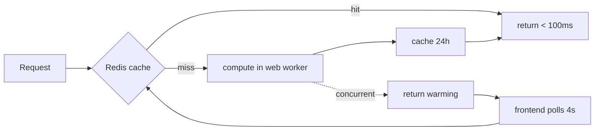
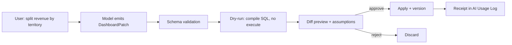

# ML + chat-refined intelligence dashboards

Design dossier · 2026-08-11 · companion to `00-REPORT.md` (Nakhoda) and `14-frontend-design.md`

Subject: `/Users/mac/ERPNext/jkm/apps/insights` — branch `jkm`, HEAD `806e2ba`.
Baseline for "is this upstream or theirs": `/Users/mac/ERPNext/nvumabaranda/apps/insights` (`develop`, `ea62bf6`).
Citations are `path:line` relative to the jkm Insights app root unless prefixed.

---

## 0. Verdict

**You are not adding ML to a BI tool. You already did — ~57,100 lines of it — and the one
feature you asked for is the one piece that was never built.**

`jkm/jkm/logs` is four log files (`ML Analytics.log`, 0 bytes). The thing you were pointing
at is the Insights fork on that bench, which ships 36 domain ML modules, 147 whitelisted
`api/ml` endpoints, 15 chat agents, 27 analysis skills, and 6 LLM providers.

Three findings decide the plan:

1. **The ML is real.** scikit-learn + statsmodels, RFM segmentation, Holt-Winters forecasting,
   GL anomaly detection, lead scoring. Keep it.
2. **The chat cannot refine anything.** It is a text completion over a ≤10 KB JSON summary.
   Zero tools, zero dashboard writes. It narrates the screen; it cannot change it.
3. **The AI layer is unauthenticated at the top and unfiltered at the bottom.** 17 whitelisted
   endpoints in `ml_engine.py` and `dashboard_chat.py` carry **zero** permission checks, and
   `get_dashboard` takes the company to query as client-supplied JSON — any logged-in user can
   read any company's P&L. Below that, 222 raw SQL queries apply no row-level filtering at all.
   This is the blocker, and it is worse than the `#919` class of bug in `00-REPORT.md` §3.2:
   that one bypassed user permissions, this one bypasses authorisation entirely.

The work is not "add ML". It is **make ML a first-class citizen of the query pipeline, make
templates data instead of code, and give the chat a validated mutation grammar** — the same
Operation JSON move `00-REPORT.md` §6.2 makes for queries, extended to dashboards.

---

## 1. What is actually there

Measured, not estimated:

| Surface | Path | LOC |
|---|---|---|
| Domain ML models | `insights/ml/` | 23,377 |
| ML API endpoints | `insights/api/ml/` | 4,930 |
| Chat agents + skills | `insights/agents/` | 3,603 |
| LLM providers | `insights/ai/` | 2,375 |
| Engine + collectors | `insights/analytics/` | 2,259 |
| Chat API | `insights/api/dashboard_chat.py` | 811 |
| AI insights API | `insights/api/ai_insights.py` | 481 |
| **Backend total** | | **37,836** |
| Intelligence + dashboard UI | `frontend/src2/{intelligence,dashboard}/` | 19,266 |
| **Total** | | **57,102** |

Counted on branch `jkm` at `1815f8c`, excluding `*.bak` (3 files, 1,390 LOC). **This is a
moving target.** The branch took three commits during this revision, and `insights/ml/` lost
2,491 lines to the SQL→ibis refactor while gaining twelve modules. Treat every LOC figure
here as a timestamp, not a constant; the structural findings below are what persist.

Composition:

- **36 domain intelligence modules** — largest are `budget_variance_intelligence.py` (1,753),
  `customer.py` (1,687), `marketing_intelligence.py` (1,552), `risk_intelligence.py` (1,227).
- **147 whitelisted ML endpoints** across 19 modules in `api/ml/`, plus 17 more in
  `ml_engine.py` and `dashboard_chat.py` that are ungated (§3.1).
- **7 model specs** with disk snapshots at
  `private/files/insights_ml_snapshots/{key}.json` (`insights/ml/base.py:81-86`):
  `sales_forecast`, `demand_forecast`, `lead_conversion`, `gl_anomaly`, `payment_model`,
  `product_recommendations`, `customer_segmentation`.
- **7 AI DocTypes**: `Dashboard Chat Session`, `Dashboard AI Agent Config`, `Insights AI Query`,
  `AI Insight Alert`, `AI Insight Feedback`, `AI Insight Share`, `AI Usage Log`.
- **6 providers**: OpenRouter (609), OpenAI (342), Ollama (273), Moonshot (193), NVIDIA (163),
  plus Codex and Kimi device-auth helpers.

### 1.1 Dependency posture — one comment worth the whole file

`pyproject.toml` promotes `scikit-learn>=1.3.0` and `statsmodels>=0.14.0` to core and
**deliberately excludes Prophet**, with the reason recorded in-place:

> Prophet is deliberately NOT here. It pulls cmdstanpy + Intel TBB (libtbb), a native thread
> pool that cannot survive rq's per-job `fork()` — the work-horse dies as
> `waitpid returned 139 (signal 11)` with no Python traceback.

That is a correctly diagnosed, correctly documented native-threading hazard. Note however that
**`prophet 1.3.0` is installed in `/Users/mac/ERPNext/jkm/env` anyway** — the guard is a
packaging decision, not an enforced invariant, and `_check_prophet()` will find it.

---

## 2. What works — keep this

**The scar tissue is worth more than the code.** Eight execution models were tried in ten
hours on 2026-08-11 (`42eb835` 05:42 → `806e2ba` 15:30), and the survivor is correct:



Why it is right: **gunicorn workers are already forked from the master, so training in the
web worker never forks a second time** — numpy/OpenBLAS stay intact. RQ's per-job `fork()`
is what corrupted them. Measured: sales 2.3 s cold → 0.002 s warm.

Abandoned, each for a real reason — do not retry any of them:

| Approach | Killed by |
|---|---|
| Inline sync training in gunicorn | 502 at the nginx timeout |
| RQ background jobs | dead work-horses wedged the queue; `fork()` → SIGSEGV |
| Daemon threads | over-engineered; still needed a sync fallback |
| `success(compute_or_cache(...))` double-wrap | buried the `warming` flag → dashboard hung forever |
| Manual "Check again" button | replaced by 4 s auto-poll |

Also keep:

- **`IntelligenceDashboardShell.vue`** (140 LOC) — one state machine ordered
  *permission → error → loading → warming → data → empty*, replacing three byte-identical
  copies. Errors are evaluated before the spinner so a future edit cannot hide them. Good design.
- **`skills.py`** (680 LOC, 27 skills) — `AnalysisSkill` frozen dataclasses carrying
  `reads` / `questions` / `signals` / `outline`, selected by dashboard **and active tab**, and
  the renderer appends the context keys actually present at runtime so the model never guesses
  where a figure lives (`skills.py:620-676`). This is the best prompt engineering in the repo.
- **The `api/ml/` permission gate.** 147 whitelisted endpoints and 163 `frappe.has_permission(...,
  throw=True)` calls, and `except frappe.PermissionError: raise` before the catch-all so a
  denial is never swallowed into a JSON string. The granularity is wrong (§3.1) and the
  discipline stops at this package's edge — but within it, it is right, and it is the pattern
  the other 17 endpoints should adopt.

---

## 3. Four defects — all verified

### 3.1 The AI layer is unauthenticated at the top and unfiltered at the bottom · **blocker**

Two independent holes that compound.

**Hole one — 17 whitelisted endpoints with no permission check at all.** Per-file
`grep -c "@frappe.whitelist"` versus `grep -c "has_permission"`:

| File | Whitelisted | Permission checks |
|---|---|---|
| `insights/analytics/ml_engine.py` | 4 | **0** |
| `insights/api/dashboard_chat.py` | 13 | **0** |
| `insights/api/ai_insights.py` | 8 | 3 |
| `insights/api/ml/*.py` (15 domains) | 168 | 168 |

`get_dashboard` is the worst case (`ml_engine.py:619-639`): no gate, and its `filters`
argument is **client-supplied JSON** that becomes the company scope. `BaseCollector` takes
`filters.get("company")` first and only falls back to the user default
(`collectors/base.py:20-23`). So any authenticated user can post
`{"company": "<any company on the site>"}` and receive that company's revenue, profit,
receivables, cash flow and AI commentary. Nothing in the path objects.

**Hole two — the 168 gated endpoints are gated at the wrong granularity.**
`frappe.has_permission("Sales Invoice", "read", throw=True)` is a **DocType-level boolean**:
it answers "may this user read Sales Invoices at all", never "which ones". Underneath, the
data comes from raw SQL with no permission clause:

```
grep -rn "get_permission_query_conditions|apply_row_permissions|apply_user_permissions
          |get_permitted_fields|build_match_conditions"
     insights/ml insights/analytics insights/agents insights/api/ml   →  0 matches
grep -rn "frappe.db.sql" insights/analytics/collectors insights/ml     →  222 matches
```

```sql
-- insights/analytics/collectors/inventory.py:101-112
SELECT warehouse, COUNT(DISTINCT item_code), SUM(actual_qty), SUM(stock_value)
FROM `tabBin` WHERE actual_qty > 0
GROUP BY warehouse ORDER BY total_value DESC
```

No company filter, no permission filter, no `LIMIT`. Better-written collectors do scope by
company — `_get_revenue` binds `AND gle.company = %s` (`collectors/financial.py:33-41`) — but
that value is the client-supplied one from hole one, and **no collector filters by user
permission**. A sales rep restricted to one territory receives company-wide aggregates.

**Hole three — the escape hatch is behind on upstream, and switched off.** The obvious fix
("route ML through the query engine") is not free here, because the fork's engine permission
layer is the *old* one. Upstream splits it three ways —
`apply_user_permissions` / `apply_column_permissions` / `apply_row_permissions` at
`nvumabaranda/.../insights_table_v3.py:299,336,350` in a 482-line file, compiling to a
`semi_join` so it stays one SQL statement, warehouse-aware, failing closed. The jkm fork has a
single 26-line `apply_user_permissions` in a 194-line file
(`insights/insights/doctype/insights_table_v3/insights_table_v3.py:108-133`) which does
`frappe.get_list(doctype, pluck="name")` and injects the result as a literal `IN` list
(`:141-146`) — every permitted primary key materialised into Python, then into the SQL text.
On a million-row table that is a million-element list.

And it never runs by default: `apply_user_permissions` and `enable_permissions` are both
`Check` fields defaulting to `'0'` in `insights_settings.json`, and the function early-returns
unless the source `is_site_db` (`:109-113`).

**Delegation is now a quick win — the fork built the choke point itself.** Between this
dossier's first draft and its revision, the SQL→ibis refactor (`1d7dffe` → `1815f8c`,
2026-08-11) landed `insights/api/ml/ibis_source.py`: 90 lines, imported by 43 files, whose
`t(doctype)` (`:65-71`) returns a bare ibis table. Upstream's three functions take `t: Table`
— the exact type it returns — so they compose directly, and one file fixes every caller at
once.

What the module has instead today is an optional `company_filter` (`:74-83`) fed by
`default_company()` (`:86-90`), which falls back to `Global Defaults.default_company` — a
site-wide value, not a permission boundary — over a connection that authenticates as the site
DB superuser (`:42-62`), so nothing below it can enforce anything. The refactor is carrying
the hole forward into cleaner code: `executive_intelligence.py` was rewritten today as a
902-line "pure-Ibis rollup" with zero permission references and its own `_company()` reading
the same global default.

Phase 0b still has to port upstream's layer forward — the fork's materialised `IN`-list
version is the wrong one to propagate — but it now has **one** insertion point instead of 170.

### 3.2 The chat cannot refine a dashboard — it has no tools and no writes

```
grep -rn "tools=|tool_calls|function_call|\"tools\"" insights/agents/ insights/ai/  →  0
grep -rln "Insights Dashboard v3" insights/agents/ insights/api/dashboard_chat.py  →  0 files
```

`BaseIntelligenceAgent.execute()` is `[system, ≤5 history, user] → client.make_request() →
return text` (`agents/base.py:199-281`). The model sees only `compress_context()` output,
hard-capped at 10 KB (`agents/base.py:80-84`), assembled by the *frontend* and pruned to 24 KB
before it is sent (`DashboardChatButton.vue:355-443`). On response the component pushes a
message into a reactive array — **the dashboard document is never re-fetched or written**.

So the current feature is *chat about a screenshot of your data*. It cannot add a chart,
change a filter, or drill in. This is exactly the "chat bubble with SQL behind a disclosure
triangle" pattern that `14-frontend-design.md` argues against.

Two consequences of the fallback loop worth pricing: `execute()` walks
`[preferred] + [fallback] + get_available_models()` in sequence (`base.py:241-250`), so a bad
prompt can burn **one paid call per model in the catalogue** before failing, and a reasoning
model that returns an empty string counts as a failure and advances to the next one
(`base.py:261-266`).

### 3.3 "Templates" are `if/elif` chains, not data

`MLAnalyticsEngine.DASHBOARD_TYPES` is a hardcoded dict of six dashboards
(`analytics/ml_engine.py:23-60`), and `_calculate_kpis` is a 180-line
`if dashboard_type == "financial": ... elif ...` chain (`ml_engine.py:113-296`); 15 such
branches across the file. What actually *ships* as a template is one demo workbook
(`insights/setup/sample_workbook.json`) plus a patch that creates **six empty dashboards**
with `items: []` for a human to fill in (`insights/patches/create_ai_analytics_dashboards.py:88-93`).

The fork also **does not define the `insights_workbook_templates` hook** that upstream uses to
let any app ship a workbook (`hooks.py`, no such key) — the one extension seam upstream offers
is unused.

Adding one domain today means editing: a collector, `data_collectors.py`, the `DASHBOARD_TYPES`
dict, two `if/elif` chains, an API module, an agent class, `skills.py`, the registry, and a Vue
view. Nine files for what should be one record.

### 3.4 Dead code that fails silently, and open chat sessions

**`retrain()` is broken.** `api/ml/model_ops.py:273` does
`from insights.api.ml.utils import compute_or_cache`, but that module is 68 lines defining
exactly `run` and `parse_date_filter` — verified by AST parse. `compute_or_cache` was removed
with the `0dccddb` → later refactors and one caller was left behind. It does not crash: the
enclosing `except Exception as e: return error(str(e))` (`model_ops.py:286-287`) converts the
`ImportError` into a JSON error string, so the Retrain button is dead and **reports nothing**.
`insights/ml/scheduler.py:11` still documents the removed architecture.

**Chat sessions are not private.** `Dashboard Chat Session` grants `Insights User`
read/write/delete with no owner restriction and no `if_owner`, and the API writes with
`session.insert(ignore_permissions=True)` / `session.save(ignore_permissions=True)`
(`dashboard_chat.py:199,141,502`). Any Insights user who can guess `CHAT-2026-00042` reads
that transcript — including the `context_snapshot`, which holds up to 60 KB of another user's
dashboard figures. There is **no retention** on `Dashboard Chat Session` or `AI Usage Log`;
both grow without bound.

---

## 4. The design — three moves

The unifying idea: **everything the AI touches must be a validated document, and every read
must go through the engine that knows about permissions.** Three moves follow from it.

### Move 1 — ML becomes an operation, not an endpoint

Today a forecast is a dict returned by one of 168 bespoke endpoints. It cannot be charted by
the normal chart layer, filtered, joined, permission-checked, or cached like anything else.

Make ML a **query operation** alongside `summarize`, `mutate`, `pivot_wider`:

```json
{ "type": "forecast", "column": "total", "date_column": "posting_date",
  "periods": 30, "method": "auto", "confidence": 0.95 }
{ "type": "detect_anomalies", "column": "debit", "method": "isolation_forest",
  "contamination": 0.01 }
{ "type": "segment", "id_column": "customer", "method": "rfm", "clusters": 5 }
{ "type": "score", "model": "lead_conversion", "id_column": "name" }
```

Consequences, all of them free:

- The **permission layer applies automatically** — the operation runs on a query whose source
  already went through `apply_row_permissions` / `get_permitted_fields`. §3.1 dissolves rather
  than being patched.
- Forecasts render in ordinary charts; no `ml_predictions` special case.
- Result caching reuses the existing `insights:query_results:` machinery.
- The chat can *emit* one, because it is just another operation in the grammar
  (`00-REPORT.md` §6.2).

Boundary: ibis cannot express Holt-Winters, so an ML operation is a **materialise-then-compute**
node — it pulls the upstream frame into pandas under the existing row cap, runs sklearn or
statsmodels, and returns a frame. That is a deliberate pipeline break and should be the *only*
one. Keep the models; delete the transport.

### Move 2 — an intelligence dashboard becomes a document

Replace the `if/elif` chains with a declarative record — `Intelligence Template`:

| Field | Type | Purpose |
|---|---|---|
| `key`, `title`, `icon`, `color` | Data | replaces the `DASHBOARD_TYPES` dict |
| `source` | Link → Insights Query | one query, permission-aware, replaces the collector |
| `metrics` | Table | label, expression, format, target, direction — replaces `_calculate_kpis` |
| `panels` | JSON | chart specs + layout, the existing `items` shape |
| `skill` | Long Text | the `AnalysisSkill` fields, authored not compiled |
| `ml` | Table | which ML operations to attach |

A new domain becomes one fixture. The six shipped domains become six fixtures, and the
`if/elif` chains and per-domain collectors are deleted — **the largest single subtraction
available in this codebase**. Ship them through the `insights_workbook_templates` hook so
other apps can contribute (§3.3), which is the seam upstream already opened.

### Move 3 — chat refines by emitting a validated patch

The dashboard is already data: `Insights Dashboard v3.items` is a JSON array of
`{i, type, chart, layout:{x,y,w,h}}`. So a refinement is a **patch over that array plus the
chart configs** — never free-form code, never raw SQL.

```json
{ "ops": [
    { "op": "add_chart", "chart_type": "bar", "query": "q_revenue",
      "dimension": "territory", "measure": "base_net_total",
      "layout": {"x":0,"y":12,"w":10,"h":8} },
    { "op": "set_filter", "column": "posting_date", "operator": "between",
      "value": ["2026-01-01","2026-06-30"] },
    { "op": "remove_item", "i": "chart_3" }
] }
```

The loop, and every step is load-bearing:



- **Validate** against a JSON Schema. An invalid patch is a retry with the error, not an apply.
- **Dry-run** compiles the resulting queries to SQL and runs nothing. Cheap; catches most errors
  without touching the database (`00-REPORT.md` §6.2).
- **Preview the diff, require approval.** This is what makes the whole thing safe enough to run
  against production, and it is the interaction `14-frontend-design.md` already mocked up.
- **Version on apply** so any refinement is revertible.

To emit a *correct* patch the model needs to see the schema, so give the agent the four tools
it currently lacks — `get_table_links`, `get_distinct_column_values`, `build_query`,
`explain_sql` (`00-REPORT.md` §6.2). `get_distinct_column_values` is what kills string
hallucination: the model stops guessing that the status is `"Completed"` when it is `"Closed"`.

Keep `skills.py` exactly as it is — it becomes the *playbook* half of the prompt while the
tools become the *capability* half. It is already tab-aware, which is precisely the routing a
patch-emitting agent needs.

---

## 5. Build plan — *for this fork, in place*

**Scope note.** This roadmap remediates `jkm/apps/insights` where it stands. "Port" here
means moving code within one AGPL-3.0 codebase, which is free. It is **not** Nakhoda's
plan and must not be read across into it: `12-build-plan.md` is a clean-room build. It
is also AGPL-3.0 (§7 there), which makes copying between the two *legal* and still
forbidden — Nakhoda keeps dual-licensing open, and that needs copyright it holds. So it
reimplements rather than ports; see its Phase 8, which reads this fork's ML modules for
method and writes its own.

Every phase ends in a gate that passes or fails on evidence. Phases 0-2 are worth building
even if the chat feature is cancelled — they are a governed semantic layer, which is what
`00-REPORT.md` §5.5 identifies as the actual product.

**Phase 0 — close the security hole.** Three steps, strictly in order.
*0a, today:* add `frappe.has_permission(..., throw=True)` to the 17 ungated endpoints in
`ml_engine.py` and `dashboard_chat.py`, and stop trusting `filters["company"]` — derive the
company from the user, or validate it against their permitted companies. Hours of work; closes
a cross-company leak that is live right now.
*0b:* port upstream's permission layer forward — the three-way
`apply_user_permissions` / `apply_column_permissions` / `apply_row_permissions` split with the
`semi_join` compilation — replacing the fork's materialised `IN`-list version, and default
`apply_user_permissions` to on.
*0c:* inject it at `api/ml/ibis_source.py:65-71`. `t(doctype)` is a single choke point imported
by 43 files, returning exactly the `t: Table` those functions accept — one file, not a sweep of
every call site. The 6 files in `insights/ml/` still on `frappe.db.sql` are the remainder; port
them onto `t()` rather than injecting `get_permission_query_conditions` a second way.
*Gate A:* an authenticated user with no ERPNext roles calling
`ml_engine.get_dashboard("financial", '{"company":"X"}')` receives a `PermissionError`, not a P&L.
*Gate B:* on a table with 1M permitted rows, the compiled query contains a subquery, not a
literal `IN` list — check the SQL, not the result.
*Gate C:* two users with different User Permissions get different totals from the same endpoint.
Reproduce `#919` against `api/ml/*` and prove it fixed.
**Not optional, and first** — retrofitting security after an engine exists is how `#919` happened.

**Phase 1 — ML as an operation.** Add `forecast` / `detect_anomalies` / `segment` / `score`
to the operation union; port `sales_forecasting`, `gl_anomaly`, `customer_segmentation` first.
*Gate:* a forecast renders in a stock chart with no `ml_predictions` branch anywhere, and
respects the caller's row permissions.

**Phase 2 — `Intelligence Template` DocType.** Port the six hardcoded domains to fixtures.
*Gate:* `DASHBOARD_TYPES`, `_calculate_kpis` and `_prepare_charts` are deleted, and a seventh
domain is added by writing one fixture and zero Python.

**Phase 3 — tools + dry-run.** Four read-only tools, running as `frappe.session.user`.
*Gate:* the agent answers a question needing a join it was not told about, and the transcript
shows the tool calls; a restricted user's answer excludes rows they cannot see.

**Phase 4 — DashboardPatch.** Schema, validator, dry-run, diff preview, approval, versioning.
*Gate:* "split revenue by territory and add last year" produces a correct patch, previews a
diff, applies on approval, and reverts cleanly. An adversarial prompt attempting a write or a
`DROP` fails validation — the grammar has no op for it.

**Phase 5 — hygiene.** Delete the `compute_or_cache` caller or restore the function; add
`if_owner` to `Dashboard Chat Session`; drop `ignore_permissions=True` from the three session
writes; add retention to `AI Usage Log` and sessions; cap the model-fallback ladder at two.
*Gate:* user B cannot read user A's session by name; Retrain either works or is gone.

---

## 6. What not to do

1. **Do not re-enqueue ML onto RQ.** `fork()` corrupts numpy/OpenBLAS thread state; it is not
   fixable at runtime. Compute in the already-forked web worker (§2).
2. **Do not install Prophet as a core dependency.** The `pyproject.toml` comment is right; it
   is currently in the venv regardless, which is a trap waiting for the first `fork()`.
3. **Do not give the model raw SQL.** A closed, validated operation grammar is a far better
   generation target and renders as a diff a human can check (`00-REPORT.md` §6.2).
4. **Do not let the AI write without approval.** Dry-run and diff-preview are the whole
   safety argument for pointing this at production.
5. **Do not wrap the envelope twice.** `c925aed` cost a day: `{status, ...data}` wrapped in
   `success()` buried the `warming` flag and hung every dashboard forever. One envelope layer,
   enforced.
6. **Do not swallow exceptions into strings.** `except Exception: return error(str(e))` is why
   a dead import (§3.4) has been shipping unnoticed. Let programmer errors raise.
7. **Do not add a 16th domain to the `if/elif` chains.** Every one added before Phase 2 is
   nine files that Phase 2 has to delete.

---

## Appendix — verification notes

Claims here were checked against source, not accepted from subagents.

- `compute_or_cache` absence: AST-parsed `insights/api/ml/utils.py` in the bench interpreter —
  defines `['run', 'parse_date_filter']` only. A subagent reported this file as 702 LOC
  containing the Redis-lock architecture; it is 68 LOC and does not. **The architecture that
  subagent described has been removed from the codebase**; only the stale caller and a
  docstring in `scheduler.py:11` remain.
- Permission absence, tool absence, and dashboard-write absence: all three are `grep` counts
  returning 0 over the named directories, reproduced inline in §3.1 and §3.2.
- LOC figures: `find … -name "*.py" -not -name "*.bak" | xargs wc -l`, and
  `find frontend/src2/{intelligence,dashboard} -name "*.vue" | xargs wc -l`.
- Endpoint and gate counts: per-file `grep -c "@frappe.whitelist"` vs `grep -c "has_permission"`.
  `api/ml/` totals 168/168, but the ratio is uneven per file — `esg.py` (3/2), `marketing.py`
  (5/4) and `search.py` (8/7) are short, while `customer.py` (17/19) and `executive.py` (17/19)
  carry extras; one ungated endpoint each in `api/ml/__init__.py` and `api/ml/utils.py`. The
  grep is a proxy for coverage, not a proof of it — the per-file shortfalls are unaudited and a
  line-by-line pass is Phase 0 work. The 4/0 and 13/0 figures for `ml_engine.py` and
  `dashboard_chat.py` need no such caveat: the substring appears nowhere in either file.
- The `get_dashboard` company leak was verified by reading the path end to end —
  `ml_engine.py:619-639` (no gate, `frappe.parse_json(filters)`) → `MLAnalyticsEngine(filter_dict)`
  → `collectors/base.py:20-23` (`filters.get("company")` first). Not executed against a live site.
- Upstream comparison used `nvumabaranda/apps/insights` @ `ea62bf6`. Its
  `insights/insights/doctype/insights_table_v3/insights_table_v3.py` is 482 lines and defines
  `apply_user_permissions` at `:299`, `apply_column_permissions` at `:336`, and
  `apply_row_permissions` at `:350`. The jkm fork's same-path file is 194 lines with one
  `apply_user_permissions` at `:108`. Both line counts by `wc -l`, both symbol positions by `grep -n`.
- Execution-model history: `git log`/`git show` on `42eb835`, `ba18fce`, `ed5b94e`, `06e2107`,
  `0dccddb`, `c925aed`, `806e2ba`. Timings quoted (2.3 s cold → 0.002 s warm) are from those
  commit messages, self-reported by the author, not independently reproduced.
